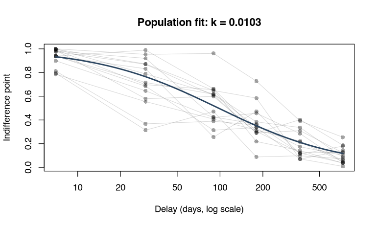

---
output:
  github_document:
    html_preview: false
---

<!-- README.md is generated from README.Rmd. Please edit that file -->

```{r setup, include = FALSE}
knitr::opts_chunk$set(echo=TRUE, comment=NA, fig.path = "man/figures/")
plotdir <- "man/figures/"
```

# Behavioral Economic (be) Easy (ez) Discounting <a></a>

[](https://cran.r-project.org/package=beezdiscounting)
[](https://cranlogs.r-pkg.org/)
[](https://cranlogs.r-pkg.org/)
[](https://github.com/brentkaplan/beezdiscounting/actions/workflows/R-CMD-check.yaml)
[](https://brentkaplan.github.io/beezdiscounting/)

An R package containing commonly used functions for analyzing behavioral economic discounting data.

The package began as a set of scoring and curve-fitting tools. It supports
scoring of the 27-Item Monetary Choice Questionnaire (see
[Kaplan et al., 2016](https://doi.org/10.1007/s40614-016-0070-9)), calculating
*k* values (and Area Under the Curve metrics) from indifference points using
nonlinear regression (Mazur's simple hyperbola and exponential), and scoring of
the minute discounting task
(see [Koffarnus & Bickel, 2014](https://doi.org/10.1037/a0035973))
using the Qualtrics 5-trial discounting template (see the
[Qualtrics Minute Discounting User Guide](https://doi.org/10.13140/RG.2.2.26495.79527)),
which is also available as a .qsf file in this package.

It now also fits discounting *models*: a mixed-effects (hierarchical) tier via
Template Model Builder (`fit_dd_tmb()`), a trial-level choice model
(`fit_dd_choice()`), and a Bayesian tier via brms (`fit_dd_brms()`). These newer
modeling tiers are available in the development version (install from GitHub, see
below); the current CRAN release (0.4.0) carries the scoring and NLS tools. Full
documentation, including worked vignettes, is available at the
[package website](https://brentkaplan.github.io/beezdiscounting/).

## Which approach should I use?

The package spans several tiers. Find the row that matches your data and question,
then follow the vignette for a worked example:

| Your data / question | Function(s) | Vignette |
|---|---|---|
| 27-Item Monetary Choice Questionnaire | `score_mcq27()` | [MCQ scoring](https://brentkaplan.github.io/beezdiscounting/articles/mcq27-scoring.html) |
| Indifference points, individual or aggregate (NLS) | `fit_dd()` / `results_dd()` | [Delay discounting basics](https://brentkaplan.github.io/beezdiscounting/articles/delay-discounting-basics.html) |
| Indifference points, mixed-effects (borrows strength across subjects) | `fit_dd_tmb()` | [Mixed-effects with TMB](https://brentkaplan.github.io/beezdiscounting/articles/tmb-mixed-effects.html) |
| Indifference points at exactly 0 or 1 | `fit_dd_tmb(family = "sltb")` | [Bounded error distributions](https://brentkaplan.github.io/beezdiscounting/articles/sltb-discounting.html) |
| Comparing discount rates between groups | `get_dd_param_emms()` / `get_dd_comparisons()` | [Group comparisons](https://brentkaplan.github.io/beezdiscounting/articles/dd-group-comparisons.html) |
| Trial-level smaller-sooner vs. larger-later choices | `fit_dd_choice()` | [Group comparisons](https://brentkaplan.github.io/beezdiscounting/articles/dd-group-comparisons.html) |
| Bayesian versions of the model tiers | `fit_dd_brms()` / `fit_dd_choice_brms()` | [Bayesian discounting](https://brentkaplan.github.io/beezdiscounting/articles/bayesian-discounting.html) |
| 5.5-trial delay or probability task | `calc_dd()` / `calc_pd()` | [5.5-trial task](https://brentkaplan.github.io/beezdiscounting/articles/fivetrial-task.html) |

## Note About Use

Currently, this version (0.4.0) appears stable. I encourage you to use it
but be aware that, as with any software release, there might be (unknown) bugs
present. I've tried hard to make this version usable while including the
core functionality (described more below). However, if you find issues or would
like to contribute, please open an issue on my
[GitHub page](https://github.com/brentkaplan/beezdiscounting) or
[email me](mailto:bkaplan.ku@gmail.com).

You may also use these functions in the
[Shinybeez](https://brentkaplan.shinyapps.io/shinybeez/) web application and
also found at the [GitHub page](https://github.com/brentkaplan/shinybeez).

## Citing the Package

If you use this package in your own work, please consider citing the package:

Kaplan, B. A. (2025). _beezdiscounting: Behavioral Economic Easy Discounting_. R package
version 0.4.0, <https://github.com/brentkaplan/beezdiscounting>

You can also find the latest citation using `citation("beezdiscounting")`

## Installing beezdiscounting

### CRAN Release (recommended method)

The latest stable version of `beezdiscounting` (currently v.0.4.0) can be found
on [CRAN](https://CRAN.R-project.org/package=beezdiscounting) and installed
using the following command. The first time you install the package, you may be
asked to select a CRAN mirror. Simply select the mirror geographically closest
to you.

```{r cran-install, eval = FALSE}
install.packages("beezdiscounting")

library(beezdiscounting)
```

### GitHub Release

The development version on
[GitHub](https://github.com/brentkaplan/beezdiscounting) carries the newer
modeling tiers (`fit_dd_tmb()`, `fit_dd_choice()`, `fit_dd_brms()`) that are not
yet on CRAN. First install and load the `devtools` package, then use
`install_github` to install the package and its vignettes. You *don’t* need to
download anything directly from
[GitHub](https://github.com/brentkaplan/beezdiscounting):

```{r git-install, eval = FALSE}
install.packages("devtools")

devtools::install_github("brentkaplan/beezdiscounting", build_vignettes = TRUE)

library(beezdiscounting)
```

```{r packages, include = FALSE, echo = FALSE}
if (!require(knitr)) {
  install.packages("knitr")
  library(knitr)
}

if (!require(tidyverse)) {
  install.packages("tidyverse")
  library(tidyverse)
}

if (!require(beezdiscounting)) {
  install.packages("beezdiscounting")
  library(beezdiscounting)
}

```

# Using the Package {#usingpackage}

## 27-item Monetary Choice Questionnaire Scoring Overview

### Example Dataset {#exdata}

An example dataset of responses on the 27-Item Monetary Choice Questionnaire
is provided. This object is called `mcq27` and is located within
the `beezdiscounting` package. These data are the example data used in the
paper by
[Kaplan et al, 2016](https://pmc.ncbi.nlm.nih.gov/articles/PMC6701266/).
Note the format of the data, which is called "long format". Long format data
are data structured such that repeated observations are stacked in multiple
rows, rather than across columns.

```{r example-data-set, echo=FALSE, results='asis'}
knitr::kable(mcq27[c(1:7, 28:34), ])
```

The first column contains the subject id. The second column contains
the question id. The third column contains the response (0 for smaller sooner,
1 for larger later)

### Converting from Wide to Long and Vice Versa

`beezdiscounting` includes several helper functions to reshape data.

##### `long_to_wide_mcq()`

Long format data are widened such that subject id is the first column
and each subsequent column contains the response associated with the question
(specified as column names).

```{r long-to-wide-mcq}
wide <- long_to_wide_mcq(generate_data_mcq(2))

knitr::kable(wide[, c(1:5, 24:28)], caption = "Wide Format Data")
```

##### `wide_to_long_mcq()`

Wide data (see example of wide data above) are made long such that subject id
is in the first column, question id (inferred from the column names from the
wide format dataframe) is the second column, and the response is the third
column.

```{r wide-to-long-mcq, results='asis'}
long <- wide_to_long_mcq(wide, items = 27)

knitr::kable(long[c(1:5, 28:32), ], caption = "Long Format Data")
```

##### `wide_to_long_mcq_excel()`

A different 'type' of wide data is that used in the 27-Item Monetary Choice
Questionnaire Automated Excel Scorer
([Kaplan et al, 2016](https://pmc.ncbi.nlm.nih.gov/articles/PMC6701266/)).
In this format, the first column is the question id and each subsequent column
represents a subject (as the column name) and the response in rows (see the
example below). This function takes the data from that format and converts
it to the format needed for `beezdiscounting` functions.

```{r wide-excel-data, echo=FALSE}
wide_excel <- structure(list(questionid = 1:27, `1` = c(1L, 1L, 1L, 1L, 0L,
1L, 0L, 0L, 0L, 1L, 1L, 1L, 1L, 0L, 1L, 1L, 1L, 0L, 1L, 1L, 1L,
1L, 1L, 1L, 1L, 1L, 0L), `2` = c(1L, 1L, 1L, 0L, 1L, 0L, 0L,
0L, 1L, 0L, 1L, 1L, 0L, 1L, 0L, 1L, 1L, 1L, 0L, 0L, 0L, 0L, 1L,
1L, 1L, 1L, 1L)), row.names = c(NA, -27L), class = c("tbl_df",
"tbl", "data.frame"))
```

```{r wide-excel, results='asis'}
knitr::kable(wide_excel[c(1:5, 22:27), ],
             caption = "Format Expected in the 27-Item MCQ Excel Scorer")

long_excel <- wide_to_long_mcq_excel(wide_excel)

knitr::kable(long_excel[c(1:5, 28:32), ], caption = "Long Format")
```

##### `long_to_wide_mcq_excel()`

Data can be manipulated from long form into a form used by the 27-Item
Monetary Choice Questionnaire Automated Excel Scorer.

```{r long-to-wide-excel, results='asis'}
wide_excel <- long_to_wide_mcq_excel(long_excel)

knitr::kable(wide_excel[c(1:5, 22:27), ],
             caption = "Format Expected in the 27-Item MCQ Excel Scorer")

```


### Generate Fake MCQ Data

Generate data specifying reproducibility and proportion of `NA` responses.

```{r gen-fake-nomissing}
## fake data with no missing values
fake_data_no_missing <- generate_data_mcq(n_ids = 2, n_items = 27,
                                          seed = 1234, prop_na = 0)
knitr::kable(fake_data_no_missing, caption = "Fake Data - No Missings")
```

```{r gen-fake-missing}
## fake data with missing values
fake_data_missing <- generate_data_mcq(n_ids = 2, n_items = 27,
                                          seed = 1234, prop_na = .1)
knitr::kable(fake_data_missing, caption = "Fake Data - Missings")
```


### Score 27-item MCQ

MCQ data can be scored regularly and can also impute using various methods
specified by [Yeh et al, 2023](https://doi.org/10.1371/journal.pone.0292258)

#### Normal (no imputation)

##### No missing data
```{r score-impute-none-1}
## normal scoring of data with no missing values
tbl1 <- score_mcq27(fake_data_no_missing)
```

```{r score-impute-none-1-output, results = 'asis', echo=FALSE}
knitr::kable(tbl1[, c(1:6)], caption = "k Values")
knitr::kable(tbl1[, c(1, 7:11)], caption = "Consistency Scores")
knitr::kable(tbl1[, c(1, 12:16)], caption = "Proportions")
```

##### Missing data
```{r score-impute-none-2}
## normal scoring of data with missings with no imputation
tbl2 <- score_mcq27(fake_data_missing)
```

```{r score-impute-none-2-output, results = 'asis', echo=FALSE}
knitr::kable(tbl2[, c(1:6)], caption = "k Values")
knitr::kable(tbl2[, c(1, 7:11)], caption = "Consistency Scores")
knitr::kable(tbl2[, c(1, 12:16)], caption = "Proportions")
```


#### GGM imputation

This approach (Group Geometric Mean) "...calculates the composite k when at
least one of the three amount set ks is fully available"
([Yeh et al, 2023](https://doi.org/10.1371/journal.pone.0292258))

```{r score-impute-ggm}
tbl3 <- score_mcq27(fake_data_missing, impute_method = "GGM")
```

```{r score-impute-ggm-output, results = 'asis', echo=FALSE}
knitr::kable(tbl3[, c(1:6)], caption = "k Values")
knitr::kable(tbl3[, c(1, 7:11)], caption = "Consistency Scores")
knitr::kable(tbl3[, c(1, 12:16)], caption = "Proportions")
```

#### INN imputation (no random component)

This approach (Item Nearest Neighbor) "...replaces the missing value with the
congruent non-missing responses to the items corresponding to the same k value"
([Yeh et al, 2023](https://doi.org/10.1371/journal.pone.0292258))

```{r score-impute-inn-norandom}
tbl4 <- score_mcq27(fake_data_missing, impute_method = "INN")
```

```{r score-impute-inn-norandom-output, results = 'asis', echo=FALSE}
knitr::kable(tbl4[, c(1:6)], caption = "k Values")
knitr::kable(tbl4[, c(1, 7:11)], caption = "Consistency Scores")
knitr::kable(tbl4[, c(1, 12:16)], caption = "Proportions")
```

#### INN imputation (with random component)

This approach (Item Nearest Neighbor with Random) "... is identical to
[INN no random component], except that when a missing response cannot be
resolved, this datum will be randomly replaced with 0 or 1,
corresponding to choosing immediate or delayed rewards, respectively"
([Yeh et al, 2023](https://doi.org/10.1371/journal.pone.0292258))

```{r score-impute-inn-random}
tbl5 <- score_mcq27(fake_data_missing, impute_method = "INN",
                    random = TRUE)
```

```{r score-impute-inn-random-output, results = 'asis', echo=FALSE}
knitr::kable(tbl5[, c(1:6)], caption = "k Values")
knitr::kable(tbl5[, c(1, 7:11)], caption = "Consistency Scores")
knitr::kable(tbl5[, c(1, 12:16)], caption = "Proportions")
```

##### Return a list
You can also return a list when INN imputation with random is specified. This
is helpful to see what values replaced the missings (`NA`s) in the original
dataset.

```{r score-impute-inn-random-list}
lst <- score_mcq27(fake_data_missing, impute_method = "INN",
                    random = TRUE, return_data = TRUE)
```

The scoring summary metric dataframe as before (access via `...$results`):

```{r score-impute-inn-random-list-output, results = 'asis', echo=FALSE}
knitr::kable(lst$results[, c(1:6)], caption = "k Values")
knitr::kable(lst$results[, c(1, 7:11)], caption = "Consistency Scores")
knitr::kable(lst$results[, c(1, 12:16)], caption = "Proportions")
```

The original data and the new responses imputed (access via `...$data`):

```{r score-impute-inn-random-list-output-2, results = 'asis', echo=FALSE}
knitr::kable(lst$data, caption = "Original Data and Imputed Data")
```

## Discount Rates via Indifference Points

### Data format

The data must be in a dataframe with the following columns:
- `id`: participant ID
- `x`: delay
- `y`: indifference point

For example, the following data set is available in the package: `dd_ip`

```{r dd-ip-data, results = 'asis'}
knitr::kable(dd_ip[1:12, ], caption = "Indifference Point Data")

```

### Identifying unsystematic data (Johnson & Bickel, 2008)

The `check_unsystematic()` function checks whether the data conform to the
assumptions of the Johnson & Bickel (2008) method. As of the development version
it computes its two criteria per `id`, so you can pass the whole data frame and
get one row per participant (single-subject input behaves as before):

```{r dd-ip-unsystematic, results = 'asis'}
unsys <- check_unsystematic(
  dat = dd_ip,
  ll = 1, # LL specification
  c1 = 0.2, # Criterion 1 threshold
  c2 = 0.1 # Criterion 2 threshold
)

knitr::kable(head(unsys, 5), caption = "Unsystematic Data Output")

```

### Calculating k

The `fit_dd()` function can be used to estimate *k* values from either
the simple hyperbola (Mazur, 1987) or exponential equation. The output
of this function can then be used in `results_dd()` and `plot_dd()` to
obtain a table of results and plots of data.

First use the `fit_dd()` function to fit the data:

```{r dd-ip-fit}

dd_fit <- fit_dd(
    dat = dd_ip,
    equation = "Hyperbolic",
    method = "Two Stage"
)

```

Then use the `results_dd()` function to get a table of results. The results
table automatically includes measures of Area Under the Curve (AUC). Three
different AUC measures are calculated:

- `auc_regular`: AUC calculated using the regular trapezoidal rule

- `auc_log10`: AUC calculated using the trapezoidal rule on the log10-transformed
  x values (Borges et al., 2016)

- `auc_ord`: AUC calculated using the trapezoidal rule on the ordinally transformed
  x values (Borges et al., 2016)

```{r dd-ip-results, results = 'asis'}
dd_results <- results_dd(dd_fit) |>
  dplyr::mutate(id = factor(id, levels = unique(dd_ip$id))) |>
  dplyr::arrange(id) |>
  dplyr::slice(1:5)

knitr::kable(dd_results[, c(1:7, 21:22)], caption = "Parameter Estimates and Information")

knitr::kable(dd_results[, c(1:3, 8:17)], caption = "Model Information")

knitr::kable(dd_results[, c(1:2, 18:20)], caption = "Area Under the Curve Values")

```

Finally, use the `plot_dd()` function to plot the data:

```{r dd-ip-plot}

plot_dd(
    fit_dd_object = dd_fit,
    xlabel = "Delay (days)", # Specify x label
    ylabel = "Indifference Point", # Specify y label
    title = "Two Stage Plot", # Specify plot title
    logx = TRUE # Specify log scale for x axis
    )

```

## Mixed-effects discounting (TMB)

Fitting each subject's curve in isolation ignores that subjects are samples from
a population. `fit_dd_tmb()` estimates the population discount rate and each
subject's rate at the same time, borrowing strength across subjects so that noisy
individuals are pulled toward the group. It is fast (a Laplace approximation with
automatic differentiation, via Template Model Builder), and the
scale-location-truncated beta family (`family = "sltb"`) handles indifference
points at exactly 0 or 1, where ordinary beta regression is undefined.

Bring your own `id`/`x`/`y` data, or simulate from the same model with
`simulate_dd_ip()`, then fit a random intercept on the discount rate:

> The code below is shown but not run in this README (the outputs are pasted
> beneath each chunk). Copy it into your session to reproduce.

```{r tmb-fit, eval = FALSE}
sim <- simulate_dd_ip(
  n_subjects = 15,
  delays     = c(7, 30, 90, 180, 365, 730),
  log_k_pop  = log(0.01),
  sigma_u    = 0.5,
  phi        = 10,
  family     = "sltb",
  equation   = "mazur",
  seed       = 1
)

fit <- fit_dd_tmb(sim, equation = "mazur", family = "sltb", random_effects = k ~ 1)
summary(fit)
```

```
TMB Mixed-Effects Discounting Model Summary
==================================================

Call:
fit_dd_tmb(data = sim, equation = "mazur", family = "sltb", random_effects = k ~
    1)

Equation: mazur
Family: sltb
Backend: TMB_mixed
Convergence: Yes
Subjects: 15  Observations: 90

--- Fixed Effects (k) ---
          term estimate std.error statistic p.value
 k:(Intercept)   0.0103    0.0016  -30.0245  <2e-16

--- Variance Components ---
               Component Estimate   Scale
 sigma_u (log10-k RE SD)   0.2287   log10
         phi (precision)  12.3247 natural

--- Fit Statistics ---
Log-likelihood: 87.54
AIC: -169.08   BIC: -161.58
```

The fitted object carries the broom and base S3 surface: `tidy()`, `glance()`,
`augment()`, `coef()`, `fixef()`, `ranef()`, `confint()`, `predict()`,
`logLik()`, `AIC()`, and `BIC()`. `ranef()` returns each subject's deviation and
their shrunken discount rate:

```{r tmb-ranef, eval = FALSE}
head(ranef(fit))
```

```
  id         u_i           k
1  1 -0.58783897 0.007523599
2 10  0.15864424 0.011146530
3 11  0.93521791 0.016777805
4 12  0.05448851 0.010551646
5 13 -0.65165654 0.007274969
6 14 -2.33015497 0.003005893
```

Plotting the population curve over the per-subject indifference points shows the
shrinkage at work:



The `equation` argument also accepts `"exponential"` and the two-parameter
hyperboloids `"green-myerson"` and `"rachlin"` (both reduce to `"mazur"` at their
shape exponent of 1), and `family = "gaussian"` gives an unbounded-residual fit.
For group designs, pass `factors =` and use the estimated marginal means and
comparisons described below. The
[mixed-effects vignette](https://brentkaplan.github.io/beezdiscounting/articles/tmb-mixed-effects.html)
walks through the full workflow.

## Choice-based discounting

When the data are trial-level smaller-sooner vs. larger-later choices rather than
indifference points, `fit_dd_choice(mode = "structural")` estimates the discount
rate `k` directly from the binary choices as a binomial GLMM. Between-subject
factors enter the `log k` design, and the same post-hoc helpers
(`get_dd_param_emms()`, `get_dd_comparisons()`) report marginal `k` per level and
contrasts as ratios of discount rates:

```{r choice-fit, eval = FALSE}
ctrl <- simulate_dd_choice(n_subjects = 12, log_k_pop = log(0.01), seed = 7)
trt  <- simulate_dd_choice(n_subjects = 12, log_k_pop = log(0.04), seed = 8)
trt$id <- paste0("t", trt$id)
ctrl$group <- "ctrl"
trt$group <- "treat"
choice_data <- rbind(ctrl, trt)

fit_choice <- fit_dd_choice(choice_data, mode = "structural", factors = "group")
get_dd_param_emms(fit_choice)
get_dd_comparisons(fit_choice)$k$contrasts_ratio
```

```
# A tibble: 2 × 6
  level            k k_log std.error conf.low conf.high
  <chr>        <dbl> <dbl>     <dbl>    <dbl>     <dbl>
1 group=ctrl  0.0113 -4.48     0.234  0.00716    0.0179
2 group=treat 0.0369 -3.30     0.212  0.0243     0.0559

# A tibble: 1 × 5
  contrast                 ratio conf.low conf.high  p.value
  <chr>                    <dbl>    <dbl>     <dbl>    <dbl>
1 group=ctrl - group=treat 0.307    0.167     0.566 0.000152
```

If your choices come from the 27-item MCQ, `mcq27_to_choice()` reshapes the
long-form responses into the per-trial `id`/`ss_amount`/`ll_amount`/`delay`/`choice`
frame that `fit_dd_choice()` expects, using the Kirby, Petry, & Bickel (1999) item
design:

```{r mcq-choice, eval = FALSE}
head(mcq27_to_choice(mcq27))
```

```
# A tibble: 6 × 5
  id    ss_amount ll_amount delay choice
  <chr>     <dbl>     <dbl> <dbl>  <dbl>
1 1            54        55   117      0
2 1            55        75    61      0
3 1            19        25    53      0
4 1            31        85     7      1
5 1            14        25    19      1
6 1            47        50   160      0
```

## Bayesian discounting (brms)

For a Bayesian treatment, `fit_dd_brms()` and `fit_dd_choice_brms()` fit the same
models via brms and Stan, with the discount rate estimated on the same natural-log
scale. This is a development-version feature, and brms (along with posterior and
loo) is a suggested package, so install it first. `fit_dd_brms()` covers all four
indifference-point equations; `fit_dd_choice_brms()` implements the structural
choice model (Mazur or exponential) in v1.

```{r brms-fit, eval = FALSE}
fit_b <- fit_dd_brms(dd_ip,
  equation = "mazur", family = "beta",
  chains = 4, iter = 2000, cores = 4, seed = 1
)
summary(fit_b)
```

```
Bayesian Mixed-Effects Discounting Model Summary (brms)
==================================================

Equation: mazur  Family: beta
Backend: brms
Converged: Yes
Subjects: 100  Observations: 600
Diagnostics: rhat_max = 1.005, divergences = 0, min bulk ESS = 559

Coefficients (posterior median / SD, natural scale):
  term_display estimate std.error
 k:(Intercept)    0.325   0.03308

Variance components:
               Component Estimate   Scale
 sigma_u (log10-k RE SD)   0.4286   log10
         phi (precision)  28.5854 natural
```

The S3 surface mirrors the TMB tier: `tidy()`, `glance()` (reporting
`elpd_loo`/`looic` and MCMC diagnostics in place of `AIC`/`BIC`), `confint()`
(quantile credible intervals), `ranef()`, and `predict()`. `get_dd_param_emms()`
and `get_dd_comparisons()` accept brms fits too, returning credible intervals and
the posterior probability of direction in place of adjusted p-values. The
[Bayesian discounting vignette](https://brentkaplan.github.io/beezdiscounting/articles/bayesian-discounting.html)
covers priors, boundary handling, and diagnostics in full.

## Scoring the Minute Discounting Tasks

### 5.5 Trial Delay Discounting Task
```{r dd, results = 'asis'}
dd_out <- calc_dd(five.fivetrial_dd)

knitr::kable(dd_out, caption = "Scoring Summary of the 5.5 Trial Delay Discounting Task")
```

### 5.5 Trial Probability Discounting Task
```{r pd, results = 'asis'}
pd_out <- calc_pd(five.fivetrial_pd)

knitr::kable(pd_out, caption = "Scoring Summary of the 5.5 Trial Probability Discounting Task")
```


## Vignettes

Worked examples live in the package vignettes, also rendered on the
[website](https://brentkaplan.github.io/beezdiscounting/articles/):

- [Scoring the 27-Item Monetary Choice Questionnaire](https://brentkaplan.github.io/beezdiscounting/articles/mcq27-scoring.html) (`vignette("mcq27-scoring")`)
- [Getting started: indifference points, k, and AUC](https://brentkaplan.github.io/beezdiscounting/articles/delay-discounting-basics.html) (`vignette("delay-discounting-basics")`)
- [Scoring the 5.5-trial discounting task](https://brentkaplan.github.io/beezdiscounting/articles/fivetrial-task.html) (`vignette("fivetrial-task")`)
- [Mixed-effects discounting with TMB](https://brentkaplan.github.io/beezdiscounting/articles/tmb-mixed-effects.html) (`vignette("tmb-mixed-effects")`)
- [Indifference points with bounded error distributions](https://brentkaplan.github.io/beezdiscounting/articles/sltb-discounting.html) (`vignette("sltb-discounting")`)
- [Comparing discounting rates between groups](https://brentkaplan.github.io/beezdiscounting/articles/dd-group-comparisons.html) (`vignette("dd-group-comparisons")`)
- [Bayesian discounting models with brms](https://brentkaplan.github.io/beezdiscounting/articles/bayesian-discounting.html) (`vignette("bayesian-discounting")`)

## Learn More About Functions

To learn more about a function and what arguments it takes, type "?" in front of the function name.

```{r learn, eval=FALSE}
?score_mcq27
```


# Recommended Readings

- Kaplan, B. A., Amlung, M., Reed, D. D., Jarmolowicz, D. P.,
McKerchar, T. L., & Lemley, S. M. (2016). Automating scoring of delay
discounting for the 21-and 27-item monetary choice questionnaires.
*The Behavior Analyst, 39*, 293-304. https://doi.org/10.1007/s40614-016-0070-9

- Reed, D. D., Niileksela, C. R., & Kaplan, B. A. (2013). Behavioral economics:
A tutorial for behavior analysts in practice. *Behavior Analysis in Practice, 6*
(1), 34–54. https://doi.org/10.1007/BF03391790

- Mazur, J. E. (1987). An adjusting procedure for studying delayed reinforcement.
In M. L. Commons, J. E. Mazur, J. A. Nevin, & H. Rachlin (Eds.), The effect of
delay and of intervening events on reinforcement value (pp. 55–73).
Lawrence Erlbaum Associates, Inc.

- Borges, A. M., Kuang, J., Milhorn, H. and Yi, R. (2016), An alternative
approach to calculating Area-Under-the-Curve (AUC) in delay discounting
research. *Journal of the Experimental Analysis of Behavior, 106*, 145-155.
https://doi.org/10.1002/jeab.219

- Kirby, K. N., Petry, N. M., & Bickel, W. K. (1999). Heroin addicts have
higher discount rates for delayed rewards than non-drug-using controls.
*Journal of Experimental Psychology: General, 128* (1), 78-87.
https://doi.org/10.1037//0096-3445.128.1.78

- Yeh, Y. H., Tegge, A. N., Freitas-Lemos, R., Myerson, J., Green, L., &
Bickel, W. K. (2023). Discounting of delayed rewards: Missing data imputation
for the 21-and 27-item monetary choice questionnaires. *PLOS ONE, 18*
(10), e0292258. https://doi.org/10.1371/journal.pone.0292258

- Koffarnus, M. N., & Bickel, W. K. (2014). A 5-trial adjusting delay
discounting task: accurate discount rates in less than one minute.
*Experimental and Clinical Psychopharmacology, 22*(3), 222-228.
https://doi.org/10.1037/a0035973

- Koffarnus, M. N., Rzeszutek, M. J., & Kaplan, B. A. (2021). Additional
discounting rates in less than one minute: Task variants for probability
and a wider range of delays. https://doi.org/10.13140/RG.2.2.31281.92000

- Koffarnus, M. N., Kaplan, B. A., & Stein, J. S. (2017). User guide for
Qualtrics minute discounting template.
https://doi.org/10.13140/RG.2.2.26495.79527

- Kim, M., Koffarnus, M. N., & Franck, C. T. (2024). Thinking inside the bounds:
Improved error distributions for indifference point data analysis and simulation
via beta regression using common discounting functions.

- Kim, M., Kaplan, B. A., Koffarnus, M. N., & Franck, C. T. (2025).
Scale-location-truncated beta regression: Expanding beta regression to accommodate
0 and 1. *arXiv*. https://arxiv.org/abs/2509.13167
