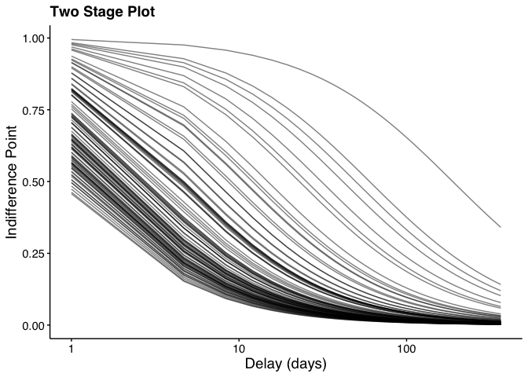

<!-- README.md is generated from README.Rmd. Please edit that file -->

# Behavioral Economic (be) Easy (ez) Discounting <a></a>

[](https://cran.r-project.org/package=beezdiscounting)
[](https://cranlogs.r-pkg.org/)
[](https://cranlogs.r-pkg.org/)

An R package containing commonly used functions for analyzing behavioral
economic discounting data.

The package supports scoring of the 27-Item Monetary Choice
Questionnaire (see [Kaplan et al.,
2016](https://doi.org/10.1007/s40614-016-0070-9)), calculating *k*
values (and Area Under the Curve metrics) from indifference points using
nonlinear regression (Mazur’s simple hyperbola and exponential), and
scoring of the minute discounting task (see [Koffarnus & Bickel,
2014](https://doi.org/10.1037/a0035973)) using the Qualtrics 5-trial
discounting template (see the [Qualtrics Minute Discounting User
Guide](https://doi.org/10.13140/RG.2.2.26495.79527)), which is also
available as a .qsf file in this package.

## Note About Use

Currently, this version (0.3.2) appears stable. I encourage you to use
it but be aware that, as with any software release, there might be
(unknown) bugs present. I’ve tried hard to make this version usable
while including the core functionality (described more below). However,
if you find issues or would like to contribute, please open an issue on
my [GitHub page](https://github.com/brentkaplan/beezdiscounting) or
[email me](mailto:bkaplan.ku@gmail.com).

You may also use these functions in the
[Shinybeez](https://brentkaplan.shinyapps.io/shinybeez/) web application
and also found at the [GitHub
page](https://github.com/brentkaplan/shinybeez).

## Citing the Package

If you use this package in your own work, please consider citing the
package:

Kaplan, B. A. (2023). *beezdiscounting: Behavioral Economic Easy
Discounting*. R package version 0.3.1,
<https://github.com/brentkaplan/beezdiscounting>

You can also find the latest citation using `citation("beezdemand")`

## Installing beezdiscounting

### CRAN Release (recommended method)

The latest stable version of `beezdiscounting` (currently v.0.3.1) can
be found on [CRAN](https://CRAN.R-project.org/package=beezdiscounting)
and installed using the following command. The first time you install
the package, you may be asked to select a CRAN mirror. Simply select the
mirror geographically closest to you.

``` r
install.packages("beezdiscounting")

library(beezdiscounting)
```

### GitHub Release

To install a stable release directly from
[GitHub](https://github.com/brentkaplan/beezdiscounting), first install
and load the `devtools` package. Then, use `install_github` to install
the package and associated vignette. You *don’t* need to download
anything directly from
[GitHub](https://github.com/brentkaplan/beezdiscounting), as you should
use the following instructions:

``` r
install.packages("devtools")

devtools::install_github("brentkaplan/beezdiscounting")

library(beezdiscounting)
```

# Using the Package

## 27-item Monetary Choice Questionnaire Scoring Overview

### Example Dataset

An example dataset of responses on the 27-Item Monetary Choice
Questionnaire is provided. This object is called `mcq27` and is located
within the `beezdiscounting` package. These data are the example data
used in the paper by [Kaplan et al,
2016](https://www.ncbi.nlm.nih.gov/pmc/articles/PMC6701266/). Note the
format of the data, which is called “long format”. Long format data are
data structured such that repeated observations are stacked in multiple
rows, rather than across columns.

|     | subjectid | questionid | response |
|:----|----------:|-----------:|---------:|
| 1   |         1 |          1 |        0 |
| 2   |         1 |          2 |        0 |
| 3   |         1 |          3 |        0 |
| 4   |         1 |          4 |        1 |
| 5   |         1 |          5 |        1 |
| 6   |         1 |          6 |        0 |
| 7   |         1 |          7 |        1 |
| 28  |         2 |          1 |        0 |
| 29  |         2 |          2 |        1 |
| 30  |         2 |          3 |        1 |
| 31  |         2 |          4 |        1 |
| 32  |         2 |          5 |        1 |
| 33  |         2 |          6 |        0 |
| 34  |         2 |          7 |        1 |

The first column contains the subject id. The second column contains the
question id. The third column contains the response (0 for smaller
sooner, 1 for larger later)

### Converting from Wide to Long and Vice Versa

`beezdiscounting` includes several helper functions to reshape data.

##### `long_to_wide_mcq()`

Long format data are widened such that subject id is the first column
and each subsequent column contains the response associated with the
question (specified as column names).

``` r
wide <- long_to_wide_mcq(generate_data_mcq(2))

knitr::kable(wide[, c(1:5, 24:28)], caption = "Wide Format Data")
```

| subjectid |   1 |   2 |   3 |   4 |  23 |  24 |  25 |  26 |  27 |
|----------:|----:|----:|----:|----:|----:|----:|----:|----:|----:|
|         1 |   1 |   1 |   1 |   1 |   1 |   1 |   1 |   1 |   0 |
|         2 |   1 |   1 |   1 |   0 |   1 |   1 |   1 |   1 |   1 |

Wide Format Data

##### `wide_to_long_mcq()`

Wide data (see example of wide data above) are made long such that
subject id is in the first column, question id (inferred from the column
names from the wide format dataframe) is the second column, and the
response is the third column.

``` r
long <- wide_to_long_mcq(wide, items = 27)

knitr::kable(long[c(1:5, 28:32), ], caption = "Long Format Data")
```

| subjectid | questionid | response |
|----------:|-----------:|---------:|
|         1 |          1 |        1 |
|         1 |          2 |        1 |
|         1 |          3 |        1 |
|         1 |          4 |        1 |
|         1 |          5 |        0 |
|         2 |          1 |        1 |
|         2 |          2 |        1 |
|         2 |          3 |        1 |
|         2 |          4 |        0 |
|         2 |          5 |        1 |

Long Format Data

##### `wide_to_long_mcq_excel()`

A different ‘type’ of wide data is that used in the 27-Item Monetary
Choice Questionnaire Automated Excel Scorer ([Kaplan et al,
2016](https://www.ncbi.nlm.nih.gov/pmc/articles/PMC6701266/)). In this
format, the first column is the question id and each subsequent column
represents a subject (as the column name) and the response in rows (see
the example below). This function takes the data from that format and
converts it to the format needed for `beezdiscounting` functions.

``` r
knitr::kable(wide_excel[c(1:5, 22:27), ],
             caption = "Format Expected in the 27-Item MCQ Excel Scorer")
```

| questionid |   1 |   2 |
|-----------:|----:|----:|
|          1 |   1 |   1 |
|          2 |   1 |   1 |
|          3 |   1 |   1 |
|          4 |   1 |   0 |
|          5 |   0 |   1 |
|         22 |   1 |   0 |
|         23 |   1 |   1 |
|         24 |   1 |   1 |
|         25 |   1 |   1 |
|         26 |   1 |   1 |
|         27 |   0 |   1 |

Format Expected in the 27-Item MCQ Excel Scorer

``` r
long_excel <- wide_to_long_mcq_excel(wide_excel)

knitr::kable(long_excel[c(1:5, 28:32), ], caption = "Long Format")
```

| subjectid | questionid | response |
|:----------|-----------:|---------:|
| 1         |          1 |        1 |
| 1         |          2 |        1 |
| 1         |          3 |        1 |
| 1         |          4 |        1 |
| 1         |          5 |        0 |
| 2         |          1 |        1 |
| 2         |          2 |        1 |
| 2         |          3 |        1 |
| 2         |          4 |        0 |
| 2         |          5 |        1 |

Long Format

##### `long_to_wide_mcq_excel()`

Data can be manipulated from long form into a form used by the 27-Item
Monetary Choice Questionnaire Automated Excel Scorer.

``` r
wide_excel <- long_to_wide_mcq_excel(long_excel)

knitr::kable(wide_excel[c(1:5, 22:27), ],
             caption = "Format Expected in the 27-Item MCQ Excel Scorer")
```

| questionid |   1 |   2 |
|-----------:|----:|----:|
|          1 |   1 |   1 |
|          2 |   1 |   1 |
|          3 |   1 |   1 |
|          4 |   1 |   0 |
|          5 |   0 |   1 |
|         22 |   1 |   0 |
|         23 |   1 |   1 |
|         24 |   1 |   1 |
|         25 |   1 |   1 |
|         26 |   1 |   1 |
|         27 |   0 |   1 |

Format Expected in the 27-Item MCQ Excel Scorer

### Generate Fake MCQ Data

Generate data specifying reproducibility and proportion of `NA`
responses.

``` r
## fake data with no missing values
fake_data_no_missing <- generate_data_mcq(n_ids = 2, n_items = 27,
                                          seed = 1234, prop_na = 0)
knitr::kable(fake_data_no_missing, caption = "Fake Data - No Missings")
```

| subjectid | questionid | response |
|----------:|-----------:|---------:|
|         1 |          1 |        1 |
|         1 |          2 |        1 |
|         1 |          3 |        1 |
|         1 |          4 |        1 |
|         1 |          5 |        0 |
|         1 |          6 |        1 |
|         1 |          7 |        0 |
|         1 |          8 |        0 |
|         1 |          9 |        0 |
|         1 |         10 |        1 |
|         1 |         11 |        1 |
|         1 |         12 |        1 |
|         1 |         13 |        1 |
|         1 |         14 |        0 |
|         1 |         15 |        1 |
|         1 |         16 |        1 |
|         1 |         17 |        1 |
|         1 |         18 |        0 |
|         1 |         19 |        1 |
|         1 |         20 |        1 |
|         1 |         21 |        1 |
|         1 |         22 |        1 |
|         1 |         23 |        1 |
|         1 |         24 |        1 |
|         1 |         25 |        1 |
|         1 |         26 |        1 |
|         1 |         27 |        0 |
|         2 |          1 |        1 |
|         2 |          2 |        1 |
|         2 |          3 |        1 |
|         2 |          4 |        0 |
|         2 |          5 |        1 |
|         2 |          6 |        0 |
|         2 |          7 |        0 |
|         2 |          8 |        0 |
|         2 |          9 |        1 |
|         2 |         10 |        0 |
|         2 |         11 |        1 |
|         2 |         12 |        1 |
|         2 |         13 |        0 |
|         2 |         14 |        1 |
|         2 |         15 |        0 |
|         2 |         16 |        1 |
|         2 |         17 |        1 |
|         2 |         18 |        1 |
|         2 |         19 |        0 |
|         2 |         20 |        0 |
|         2 |         21 |        0 |
|         2 |         22 |        0 |
|         2 |         23 |        1 |
|         2 |         24 |        1 |
|         2 |         25 |        1 |
|         2 |         26 |        1 |
|         2 |         27 |        1 |

Fake Data - No Missings

``` r
## fake data with missing values
fake_data_missing <- generate_data_mcq(n_ids = 2, n_items = 27,
                                          seed = 1234, prop_na = .1)
knitr::kable(fake_data_missing, caption = "Fake Data - Missings")
```

| subjectid | questionid | response |
|----------:|-----------:|---------:|
|         1 |          1 |        1 |
|         1 |          2 |       NA |
|         1 |          3 |        1 |
|         1 |          4 |        1 |
|         1 |          5 |        0 |
|         1 |          6 |        1 |
|         1 |          7 |        0 |
|         1 |          8 |        0 |
|         1 |          9 |        0 |
|         1 |         10 |        1 |
|         1 |         11 |        1 |
|         1 |         12 |        1 |
|         1 |         13 |        1 |
|         1 |         14 |        0 |
|         1 |         15 |       NA |
|         1 |         16 |        1 |
|         1 |         17 |        1 |
|         1 |         18 |        0 |
|         1 |         19 |        1 |
|         1 |         20 |        1 |
|         1 |         21 |        1 |
|         1 |         22 |        1 |
|         1 |         23 |        1 |
|         1 |         24 |        1 |
|         1 |         25 |        1 |
|         1 |         26 |        1 |
|         1 |         27 |        0 |
|         2 |          1 |        1 |
|         2 |          2 |        1 |
|         2 |          3 |        1 |
|         2 |          4 |        0 |
|         2 |          5 |        1 |
|         2 |          6 |        0 |
|         2 |          7 |        0 |
|         2 |          8 |        0 |
|         2 |          9 |        1 |
|         2 |         10 |        0 |
|         2 |         11 |       NA |
|         2 |         12 |        1 |
|         2 |         13 |        0 |
|         2 |         14 |        1 |
|         2 |         15 |        0 |
|         2 |         16 |       NA |
|         2 |         17 |        1 |
|         2 |         18 |        1 |
|         2 |         19 |        0 |
|         2 |         20 |        0 |
|         2 |         21 |        0 |
|         2 |         22 |       NA |
|         2 |         23 |        1 |
|         2 |         24 |        1 |
|         2 |         25 |        1 |
|         2 |         26 |        1 |
|         2 |         27 |        1 |

Fake Data - Missings

### Score 27-item MCQ

MCQ data can be scored regularly and can also impute using various
methods specified by [Yeh et al,
2023](https://doi.org/10.1371/journal.pone.0292258)

#### Normal (no imputation)

##### No missing data

``` r
## normal scoring of data with no missing values
tbl1 <- score_mcq27(fake_data_no_missing)
```

| subjectid | overall_k |  small_k | medium_k |  large_k | geomean_k |
|----------:|----------:|---------:|---------:|---------:|----------:|
|         1 |  0.000158 | 0.000158 | 0.000158 | 0.000251 |  0.000185 |
|         2 |  0.000251 | 0.001562 | 0.004469 | 0.000158 |  0.001034 |

k Values

| subjectid | overall_consistency | small_consistency | medium_consistency | large_consistency | composite_consistency |
|---:|---:|---:|---:|---:|---:|
| 1 | 0.740741 | 0.666667 | 0.666667 | 1.000000 | 0.777778 |
| 2 | 0.629630 | 0.777778 | 0.555556 | 0.666667 | 0.666667 |

Consistency Scores

| subjectid | overall_proportion | small_proportion | medium_proportion | large_proportion | impute_method |
|---:|---:|---:|---:|---:|:---|
| 1 | 0.740741 | 0.666667 | 0.666667 | 0.888889 | none |
| 2 | 0.592593 | 0.555556 | 0.555556 | 0.666667 | none |

Proportions

##### Missing data

``` r
## normal scoring of data with missings with no imputation
tbl2 <- score_mcq27(fake_data_missing)
```

| subjectid | overall_k |  small_k | medium_k |  large_k | geomean_k |
|----------:|----------:|---------:|---------:|---------:|----------:|
|         1 |        NA | 0.000158 | 0.000158 |       NA |        NA |
|         2 |        NA |       NA |       NA | 0.000158 |        NA |

k Values

| subjectid | overall_consistency | small_consistency | medium_consistency | large_consistency | composite_consistency |
|---:|---:|---:|---:|---:|---:|
| 1 | NA | 0.666667 | 0.666667 | NA | NA |
| 2 | NA | NA | NA | 0.666667 | NA |

Consistency Scores

| subjectid | overall_proportion | small_proportion | medium_proportion | large_proportion | impute_method |
|---:|---:|---:|---:|---:|:---|
| 1 | NA | 0.666667 | 0.666667 | NA | none |
| 2 | NA | NA | NA | 0.666667 | none |

Proportions

#### GGM imputation

This approach (Group Geometric Mean) “…calculates the composite k when
at least one of the three amount set ks is fully available” ([Yeh et al,
2023](https://doi.org/10.1371/journal.pone.0292258))

``` r
tbl3 <- score_mcq27(fake_data_missing, impute_method = "GGM")
```

| subjectid | overall_k |  small_k | medium_k |  large_k | geomean_k |
|----------:|----------:|---------:|---------:|---------:|----------:|
|         1 |        NA | 0.000158 | 0.000158 |       NA |  0.000158 |
|         2 |        NA |       NA |       NA | 0.000158 |  0.000158 |

k Values

| subjectid | overall_consistency | small_consistency | medium_consistency | large_consistency | composite_consistency |
|---:|---:|---:|---:|---:|---:|
| 1 | NA | 0.666667 | 0.666667 | NA | NA |
| 2 | NA | NA | NA | 0.666667 | NA |

Consistency Scores

| subjectid | overall_proportion | small_proportion | medium_proportion | large_proportion | impute_method |
|---:|---:|---:|---:|---:|:---|
| 1 | NA | 0.666667 | 0.666667 | NA | GGM |
| 2 | NA | NA | NA | 0.666667 | GGM |

Proportions

#### INN imputation (no random component)

This approach (Item Nearest Neighbor) “…replaces the missing value with
the congruent non-missing responses to the items corresponding to the
same k value” ([Yeh et al,
2023](https://doi.org/10.1371/journal.pone.0292258))

``` r
tbl4 <- score_mcq27(fake_data_missing, impute_method = "INN")
```

| subjectid | overall_k |  small_k | medium_k |  large_k | geomean_k |
|----------:|----------:|---------:|---------:|---------:|----------:|
|         1 |  0.000158 | 0.000158 | 0.000158 | 0.000251 |  0.000185 |
|         2 |        NA |       NA | 0.063154 | 0.000158 |        NA |

k Values

| subjectid | overall_consistency | small_consistency | medium_consistency | large_consistency | composite_consistency |
|---:|---:|---:|---:|---:|---:|
| 1 | 0.740741 | 0.666667 | 0.666667 | 1.000000 | 0.777778 |
| 2 | NA | NA | 0.666667 | 0.666667 | NA |

Consistency Scores

| subjectid | overall_proportion | small_proportion | medium_proportion | large_proportion | impute_method |
|---:|---:|---:|---:|---:|:---|
| 1 | 0.740741 | 0.666667 | 0.666667 | 0.888889 | INN |
| 2 | NA | NA | 0.444444 | 0.666667 | INN |

Proportions

#### INN imputation (with random component)

This approach (Item Nearest Neighbor with Random) “… is identical to
\[INN no random component\], except that when a missing response cannot
be resolved, this datum will be randomly replaced with 0 or 1,
corresponding to choosing immediate or delayed rewards, respectively”
([Yeh et al, 2023](https://doi.org/10.1371/journal.pone.0292258))

``` r
tbl5 <- score_mcq27(fake_data_missing, impute_method = "INN",
                    random = TRUE)
```

| subjectid | overall_k |  small_k | medium_k |  large_k | geomean_k |
|----------:|----------:|---------:|---------:|---------:|----------:|
|         1 |  0.000158 | 0.000158 | 0.000158 | 0.000251 |  0.000185 |
|         2 |  0.000251 | 0.001562 | 0.063154 | 0.000158 |  0.002500 |

k Values

| subjectid | overall_consistency | small_consistency | medium_consistency | large_consistency | composite_consistency |
|---:|---:|---:|---:|---:|---:|
| 1 | 0.740741 | 0.666667 | 0.666667 | 1.000000 | 0.777778 |
| 2 | 0.592593 | 0.777778 | 0.666667 | 0.666667 | 0.703704 |

Consistency Scores

| subjectid | overall_proportion | small_proportion | medium_proportion | large_proportion | impute_method |
|---:|---:|---:|---:|---:|:---|
| 1 | 0.740741 | 0.666667 | 0.666667 | 0.888889 | INN with random |
| 2 | 0.555556 | 0.555556 | 0.444444 | 0.666667 | INN with random |

Proportions

##### Return a list

You can also return a list when INN imputation with random is specified.
This is helpful to see what values replaced the missings (`NA`s) in the
original dataset.

``` r
lst <- score_mcq27(fake_data_missing, impute_method = "INN",
                    random = TRUE, return_data = TRUE)
```

The scoring summary metric dataframe as before (access via
`...$results`):

| subjectid | overall_k |  small_k | medium_k |  large_k | geomean_k |
|----------:|----------:|---------:|---------:|---------:|----------:|
|         1 |  0.000158 | 0.000158 | 0.000158 | 0.000251 |  0.000185 |
|         2 |  0.000251 | 0.001562 | 0.063154 | 0.000158 |  0.002500 |

k Values

| subjectid | overall_consistency | small_consistency | medium_consistency | large_consistency | composite_consistency |
|---:|---:|---:|---:|---:|---:|
| 1 | 0.740741 | 0.666667 | 0.666667 | 1.000000 | 0.777778 |
| 2 | 0.555556 | 0.666667 | 0.666667 | 0.666667 | 0.666667 |

Consistency Scores

| subjectid | overall_proportion | small_proportion | medium_proportion | large_proportion | impute_method |
|---:|---:|---:|---:|---:|:---|
| 1 | 0.740741 | 0.666667 | 0.666667 | 0.888889 | INN with random |
| 2 | 0.518519 | 0.444444 | 0.444444 | 0.666667 | INN with random |

Proportions

The original data and the new responses imputed (access via `...$data`):

| subjectid | questionid | response | newresponse |
|----------:|-----------:|---------:|------------:|
|         1 |          1 |        1 |           1 |
|         1 |          2 |       NA |           1 |
|         1 |          3 |        1 |           1 |
|         1 |          4 |        1 |           1 |
|         1 |          5 |        0 |           0 |
|         1 |          6 |        1 |           1 |
|         1 |          7 |        0 |           0 |
|         1 |          8 |        0 |           0 |
|         1 |          9 |        0 |           0 |
|         1 |         10 |        1 |           1 |
|         1 |         11 |        1 |           1 |
|         1 |         12 |        1 |           1 |
|         1 |         13 |        1 |           1 |
|         1 |         14 |        0 |           0 |
|         1 |         15 |       NA |           1 |
|         1 |         16 |        1 |           1 |
|         1 |         17 |        1 |           1 |
|         1 |         18 |        0 |           0 |
|         1 |         19 |        1 |           1 |
|         1 |         20 |        1 |           1 |
|         1 |         21 |        1 |           1 |
|         1 |         22 |        1 |           1 |
|         1 |         23 |        1 |           1 |
|         1 |         24 |        1 |           1 |
|         1 |         25 |        1 |           1 |
|         1 |         26 |        1 |           1 |
|         1 |         27 |        0 |           0 |
|         2 |          1 |        1 |           1 |
|         2 |          2 |        1 |           1 |
|         2 |          3 |        1 |           1 |
|         2 |          4 |        0 |           0 |
|         2 |          5 |        1 |           1 |
|         2 |          6 |        0 |           0 |
|         2 |          7 |        0 |           0 |
|         2 |          8 |        0 |           0 |
|         2 |          9 |        1 |           1 |
|         2 |         10 |        0 |           0 |
|         2 |         11 |       NA |           0 |
|         2 |         12 |        1 |           1 |
|         2 |         13 |        0 |           0 |
|         2 |         14 |        1 |           1 |
|         2 |         15 |        0 |           0 |
|         2 |         16 |       NA |           0 |
|         2 |         17 |        1 |           1 |
|         2 |         18 |        1 |           1 |
|         2 |         19 |        0 |           0 |
|         2 |         20 |        0 |           0 |
|         2 |         21 |        0 |           0 |
|         2 |         22 |       NA |           0 |
|         2 |         23 |        1 |           1 |
|         2 |         24 |        1 |           1 |
|         2 |         25 |        1 |           1 |
|         2 |         26 |        1 |           1 |
|         2 |         27 |        1 |           1 |

Original Data and Imputed Data

## Discount Rates via Indifference Points

### Data format

The data must be in a dataframe with the following columns: - `id`:
participant ID - `x`: delay - `y`: indifference point

For example, the following data set is available in the package: `dd_ip`

``` r
knitr::kable(dd_ip[1:12, ], caption = "Indifference Point Data")
```

| id  |   x |         y |
|:----|----:|----------:|
| P1  |   1 | 0.8162505 |
| P1  |   7 | 0.3908523 |
| P1  |  30 | 0.0191631 |
| P1  |  90 | 0.0990859 |
| P1  | 180 | 0.0134581 |
| P1  | 365 | 0.0035518 |
| P2  |   1 | 0.5724503 |
| P2  |   7 | 0.1652014 |
| P2  |  30 | 0.0326867 |
| P2  |  90 | 0.0802244 |
| P2  | 180 | 0.0275921 |
| P2  | 365 | 0.0247967 |

Indifference Point Data

### Identifying unsystematic data (Johnson & Bickel, 2008)

The `check_unsystematic()` function can be used to check whether the
data conform to the assumptions of the Johnson & Bickel (2008) method.
The function is designed to work with a single participant. As will
often be the case, you will want to run this for each unique participant
in the dataset as shown below:

``` r
unsys <- dd_ip |>
  dplyr::group_split(id) |>
  purrr::map_dfr(~ check_unsystematic(
    dat = .x,
    ll = 1, # LL specification
    c1 = 0.2, # Criterion 1 threshold
    c2 = 0.1 # Criterion 2 threshold
  )) |>
  dplyr::mutate(id = factor(id, levels = unique(dd_ip$id))) |>
  dplyr::arrange(id) |>
  dplyr::slice(1:5)

knitr::kable(unsys, caption = "Unsystematic Data Output")
```

| id  | c1_pass | c2_pass |
|:----|:--------|:--------|
| P1  | TRUE    | TRUE    |
| P2  | TRUE    | TRUE    |
| P3  | TRUE    | TRUE    |
| P4  | TRUE    | TRUE    |
| P5  | TRUE    | TRUE    |

Unsystematic Data Output

### Calculating k

The `fit_dd()` function can be used to estimate *k* values from either
the simple hyperbola (Mazur, 1987) or exponential equation. The output
of this function can then be used in `results_dd()` and `plot_dd()` to
obtain a table of results and plots of data.

First use the `fit_dd()` function to fit the data:

``` r
dd_fit <- fit_dd(
    dat = dd_ip,
    equation = "Hyperbolic",
    method = "Two Stage"
)
```

Then use the `results_dd()` function to get a table of results. The
results table automatically includes measures of Area Under the Curve
(AUC). Three different AUC measures are calculated:

- `auc_regular`: AUC calculated using the regular trapezoidal rule

- `auc_log10`: AUC calculated using the trapezoidal rule on the
  log10-transformed x values (Borges et al., 2016)

- `auc_ord`: AUC calculated using the trapezoidal rule on the ordinally
  transformed x values (Borges et al., 2016)

``` r
dd_results <- results_dd(dd_fit) |>
  dplyr::mutate(id = factor(id, levels = unique(dd_ip$id))) |>
  dplyr::arrange(id) |>
  dplyr::slice(1:5)

knitr::kable(dd_results[, c(1:7, 21:22)], caption = "Parameter Estimates and Information")
```

| method    | id  | term |  estimate | std.error | statistic |   p.value |  conf_low | conf_high |
|:----------|:----|:-----|----------:|----------:|----------:|----------:|----------:|----------:|
| Two Stage | P1  | k    | 0.2481617 | 0.0432495 |  5.737907 | 0.0022525 | 0.1369853 | 0.3593381 |
| Two Stage | P2  | k    | 0.7338717 | 0.0839848 |  8.738149 | 0.0003252 | 0.5179819 | 0.9497615 |
| Two Stage | P3  | k    | 0.5551845 | 0.0810197 |  6.852465 | 0.0010110 | 0.3469168 | 0.7634522 |
| Two Stage | P4  | k    | 0.2844655 | 0.0264744 | 10.744931 | 0.0001210 | 0.2164109 | 0.3525200 |
| Two Stage | P5  | k    | 1.0135883 | 0.0760710 | 13.324235 | 0.0000426 | 0.8180415 | 1.2091351 |

Parameter Estimates and Information

``` r
knitr::kable(dd_results[, c(1:3, 8:17)], caption = "Model Information")
```

| method | id | term | sigma | isConv | finTol | logLik | AIC | BIC | deviance | df.residual | nobs | R2 |
|:---|:---|:---|---:|:---|---:|---:|---:|---:|---:|---:|---:|---:|
| Two Stage | P1 | k | 0.0529456 | TRUE | 0 | 9.664278 | -15.32856 | -15.74504 | 0.0140162 | 5 | 6 | 0.9735088 |
| Two Stage | P2 | k | 0.0324102 | TRUE | 0 | 12.609020 | -21.21804 | -21.63452 | 0.0052521 | 5 | 6 | 0.9769628 |
| Two Stage | P3 | k | 0.0419241 | TRUE | 0 | 11.064704 | -18.12941 | -18.54589 | 0.0087881 | 5 | 6 | 0.9715690 |
| Two Stage | P4 | k | 0.0278923 | TRUE | 0 | 13.509754 | -23.01951 | -23.43599 | 0.0038899 | 5 | 6 | 0.9917668 |
| Two Stage | P5 | k | 0.0205973 | TRUE | 0 | 15.328915 | -26.65783 | -27.07431 | 0.0021212 | 5 | 6 | 0.9886979 |

Model Information

``` r
knitr::kable(dd_results[, c(1:2, 18:20)], caption = "Area Under the Curve Values")
```

| method    | id  | auc_regular | auc_log10 |   auc_ord |
|:----------|:----|------------:|----------:|----------:|
| Two Stage | P1  |   0.0508842 | 0.2071525 | 0.1554101 |
| Two Stage | P2  |   0.0482794 | 0.1290330 | 0.1007213 |
| Two Stage | P3  |   0.0409701 | 0.1487396 | 0.1126794 |
| Two Stage | P4  |   0.0313241 | 0.1915161 | 0.1386907 |
| Two Stage | P5  |   0.0169814 | 0.0994360 | 0.0722988 |

Area Under the Curve Values

Finally, use the `plot_dd()` function to plot the data:

``` r
plot_dd(
    fit_dd_object = dd_fit,
    xlabel = "Delay (days)", # Specify x label
    ylabel = "Indifference Point", # Specify y label
    title = "Two Stage Plot", # Specify plot title
    logx = TRUE # Specify log scale for x axis
    )
```

<!-- -->

## Scoring the Minute Discounting Tasks

### 5.5 Trial Delay Discounting Task

``` r
dd_out <- calc_dd(five.fivetrial_dd)

knitr::kable(dd_out, caption = "Scoring Summary of the 5.5 Trial Delay Discounting Task")
```

| ResponseId | index | q | firstclick | lastclick | pagesubmit | totalclicks | response | attentionflag | kval | ed50 |
|---:|:---|---:|---:|---:|---:|---:|:---|:---|---:|---:|
| 1 | I16 | 1 | 1.761 | 1.761 | 3.337 | 1 | ll | No | 0.0067058 | 149.1249275 |
| 1 | I24 | 2 | 7.729 | 7.729 | 8.457 | 1 | ss | No | 0.0067058 | 149.1249275 |
| 1 | I20 | 3 | 1.558 | 1.558 | 3.377 | 1 | ll | No | 0.0067058 | 149.1249275 |
| 1 | I22 | 4 | 2.333 | 3.949 | 4.501 | 2 | ss | No | 0.0067058 | 149.1249275 |
| 1 | I21 | 5 | 3.161 | 3.161 | 3.728 | 1 | ss | No | 0.0067058 | 149.1249275 |
| 2 | I16 | 1 | 3.779 | 3.779 | 4.351 | 1 | ss | No | 4.8989795 | 0.2041241 |
| 2 | I8 | 2 | 1.454 | 1.454 | 3.190 | 1 | ss | No | 4.8989795 | 0.2041241 |
| 2 | I4 | 3 | 1.179 | 1.179 | 3.144 | 1 | ll | No | 4.8989795 | 0.2041241 |
| 2 | I6 | 4 | 0.873 | 0.873 | 3.256 | 1 | ss | No | 4.8989795 | 0.2041241 |
| 2 | I5 | 5 | 2.621 | 2.621 | 3.258 | 1 | ss | No | 4.8989795 | 0.2041241 |
| 3 | I16 | 1 | 1.115 | 1.115 | 3.272 | 1 | ss | Yes | NA | NA |
| 3 | I8 | 2 | 0.679 | 0.679 | 3.074 | 1 | ss | Yes | NA | NA |
| 3 | I4 | 3 | 0.606 | 0.606 | 3.044 | 1 | ss | Yes | NA | NA |
| 3 | I2 | 4 | 0.745 | 0.745 | 3.302 | 1 | ss | Yes | NA | NA |
| 3 | I1 | 5 | 0.924 | 0.924 | 4.181 | 1 | ss | Yes | NA | NA |
| 3 | AttendSS | 6 | 1.450 | 1.450 | 4.181 | 1 | ss | Yes | NA | NA |
| 4 | I16 | 1 | 1.011 | 1.011 | 3.190 | 1 | ll | Yes | NA | NA |
| 4 | I24 | 2 | 1.041 | 1.041 | 3.109 | 1 | ll | Yes | NA | NA |
| 4 | I28 | 3 | 0.806 | 0.806 | 3.113 | 1 | ll | Yes | NA | NA |
| 4 | I30 | 4 | 0.822 | 0.822 | 3.487 | 1 | ll | Yes | NA | NA |
| 4 | I31 | 5 | 0.914 | 0.914 | 3.170 | 1 | ll | Yes | NA | NA |
| 4 | AttendLL | 6 | 2.158 | 2.158 | 3.573 | 1 | ll | Yes | NA | NA |

Scoring Summary of the 5.5 Trial Delay Discounting Task

### 5.5 Trial Probability Discounting Task

``` r
pd_out <- calc_pd(five.fivetrial_pd)

knitr::kable(pd_out, caption = "Scoring Summary of the 5.5 Trial Probability Discounting Task")
```

| ResponseId | index | q | firstclick | lastclick | pagesubmit | totalclicks | response | attentionflag | hval | etheta50 | ep50 |
|---:|:---|---:|---:|---:|---:|---:|:---|:---|---:|---:|---:|
| 1 | I16 | 1 | 3.980 | 3.980 | 5.184 | 1 | sc | No | 7.435436 | 0.1344911 | 88.14525 |
| 1 | I8 | 2 | 4.010 | 4.010 | 4.763 | 1 | lu | No | 7.435436 | 0.1344911 | 88.14525 |
| 1 | I12 | 3 | 2.061 | 2.061 | 3.252 | 1 | sc | No | 7.435436 | 0.1344911 | 88.14525 |
| 1 | I10 | 4 | 1.525 | 1.525 | 3.019 | 1 | sc | No | 7.435436 | 0.1344911 | 88.14525 |
| 1 | I9 | 5 | 2.253 | 2.954 | 3.738 | 2 | lu | No | 7.435436 | 0.1344911 | 88.14525 |
| 2 | I16 | 1 | 2.873 | 2.873 | 3.883 | 1 | sc | No | 99.000000 | 0.0101010 | 99.00000 |
| 2 | I8 | 2 | 3.745 | 3.745 | 4.864 | 1 | sc | No | 99.000000 | 0.0101010 | 99.00000 |
| 2 | I4 | 3 | 1.159 | 1.159 | 6.356 | 1 | sc | No | 99.000000 | 0.0101010 | 99.00000 |
| 2 | I2 | 4 | 3.064 | 3.064 | 5.408 | 1 | sc | No | 99.000000 | 0.0101010 | 99.00000 |
| 2 | I1 | 5 | 2.049 | 2.049 | 5.097 | 1 | sc | No | 99.000000 | 0.0101010 | 99.00000 |
| 2 | AttendSS | 6 | 2.295 | 2.295 | 4.641 | 1 | lu | No | 99.000000 | 0.0101010 | 99.00000 |
| 3 | I16 | 1 | 8.933 | 8.933 | 9.769 | 1 | sc | No | 1.601445 | 0.6244361 | 61.55983 |
| 3 | I8 | 2 | 2.163 | 2.163 | 2.981 | 1 | lu | No | 1.601445 | 0.6244361 | 61.55983 |
| 3 | I12 | 3 | 3.129 | 3.129 | 3.895 | 1 | lu | No | 1.601445 | 0.6244361 | 61.55983 |
| 3 | I14 | 4 | 2.655 | 2.655 | 4.855 | 1 | lu | No | 1.601445 | 0.6244361 | 61.55983 |
| 3 | I15 | 5 | 4.021 | 4.021 | 4.705 | 1 | sc | No | 1.601445 | 0.6244361 | 61.55983 |
| 4 | I16 | 1 | 4.415 | 4.415 | 5.382 | 1 | sc | No | 7.435436 | 0.1344911 | 88.14525 |
| 4 | I8 | 2 | 6.123 | 6.123 | 6.974 | 1 | lu | No | 7.435436 | 0.1344911 | 88.14525 |
| 4 | I12 | 3 | 1.673 | 1.673 | 3.191 | 1 | sc | No | 7.435436 | 0.1344911 | 88.14525 |
| 4 | I10 | 4 | 1.757 | 1.757 | 3.259 | 1 | sc | No | 7.435436 | 0.1344911 | 88.14525 |
| 4 | I9 | 5 | 1.207 | 1.207 | 4.592 | 1 | lu | No | 7.435436 | 0.1344911 | 88.14525 |

Scoring Summary of the 5.5 Trial Probability Discounting Task

## Learn More About Functions

To learn more about a function and what arguments it takes, type “?” in
front of the function name.

``` r
?score_mcq27
```

# Recommended Readings

- Kaplan, B. A., Amlung, M., Reed, D. D., Jarmolowicz, D. P.,
  McKerchar, T. L., & Lemley, S. M. (2016). Automating scoring of delay
  discounting for the 21-and 27-item monetary choice questionnaires.
  *The Behavior Analyst, 39*, 293-304.
  <https://doi.org/10.1007/s40614-016-0070-9>

- Reed, D. D., Niileksela, C. R., & Kaplan, B. A. (2013). Behavioral
  economics: A tutorial for behavior analysts in practice. *Behavior
  Analysis in Practice, 6* (1), 34–54.
  <https://doi.org/10.1007/BF03391790>

- Kirby, K. N., Petry, N. M., & Bickel, W. K. (1999). Heroin addicts
  have higher discount rates for delayed rewards than non-drug-using
  controls. *Journal of Experimental Psychology: General, 128* (1),
  78-87. <https://doi.org/10.1037//0096-3445.128.1.78>

- Yeh, Y. H., Tegge, A. N., Freitas-Lemos, R., Myerson, J., Green, L., &
  Bickel, W. K. (2023). Discounting of delayed rewards: Missing data
  imputation for the 21-and 27-item monetary choice questionnaires.
  *PLOS ONE, 18* (10), e0292258.
  <https://doi.org/10.1371/journal.pone.0292258>

- Koffarnus, M. N., & Bickel, W. K. (2014). A 5-trial adjusting delay
  discounting task: accurate discount rates in less than one minute.
  *Experimental and Clinical Psychopharmacology, 22*(3), 222-228.
  <https://doi.org/10.1037/a0035973>

- Koffarnus, M. N., Rzeszutek, M. J., & Kaplan, B. A. (2021). Additional
  discounting rates in less than one minute: Task variants for
  probability and a wider range of delays.
  <https://doi.org/10.13140/RG.2.2.31281.92000>

- Koffarnus, M. N., Kaplan, B. A., & Stein, J. S. (2017). User guide for
  Qualtrics minute discounting template.
  <https://doi.org/10.13140/RG.2.2.26495.79527>
