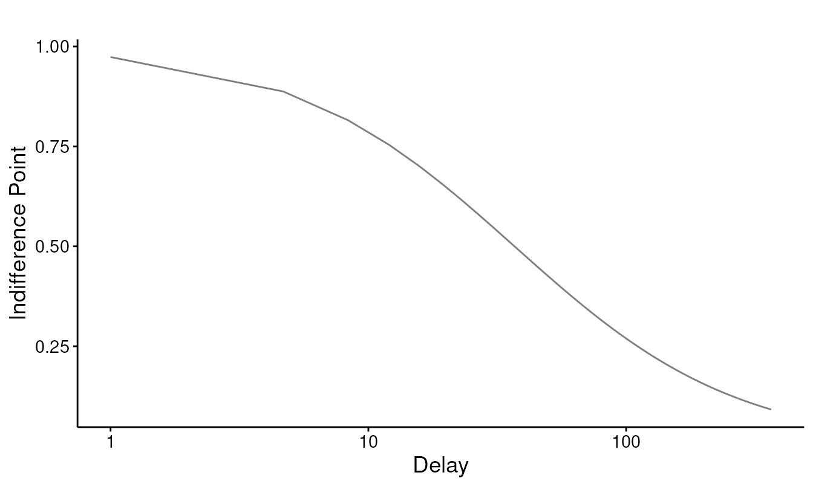

# Getting started: indifference points, k, and AUC

This vignette covers the everyday delay-discounting workflow in
`beezdiscounting`: screen the data for quality, fit a discounting model
to get a rate `k`, and compute area under the curve (AUC) as a
model-free summary. It is the place to start before moving on to the
mixed-effects and Bayesian tiers.

## Indifference points

A delay-discounting task trades a smaller-sooner reward against a
larger-later one across several delays. At each delay the **indifference
point** is the immediate amount that feels equivalent to the later
reward, expressed as a proportion of that later reward, which places it
on `[0, 1]`. A value near 1 means the person barely discounts the delay;
a value near 0 means the delayed reward is worth almost nothing to them.

`beezdiscounting` works with long-format data: one row per subject per
delay, with columns `id`, `x` (the delay), and `y` (the indifference
point). Here is one well-behaved subject:

``` r

clean <- data.frame(
  id = "demo",
  x  = c(1, 7, 30, 90, 180, 365),
  y  = c(0.95, 0.81, 0.55, 0.32, 0.17, 0.08)
)
clean
#>     id   x    y
#> 1 demo   1 0.95
#> 2 demo   7 0.81
#> 3 demo  30 0.55
#> 4 demo  90 0.32
#> 5 demo 180 0.17
#> 6 demo 365 0.08
```

## Screening for unsystematic data

Before fitting anything, check whether each subject’s indifference
points form an orderly, decreasing pattern.
[`check_unsystematic()`](https://brentkaplan.github.io/beezdiscounting/reference/check_unsystematic.md)
applies the two criteria of Johnson and Bickel (2008) to each subject’s
points, taken in delay order, and returns one row per `id`:

``` r

check_unsystematic(clean)
#> # A tibble: 1 × 3
#>   id    c1_pass c2_pass
#>   <chr> <lgl>   <lgl>  
#> 1 demo  TRUE    TRUE
```

- **Criterion 1 (`c1_pass`)** flags non-systematic *increases*: no
  indifference point may exceed the immediately preceding
  (shorter-delay) point by more than `c1` (default 0.2, i.e. 20% of the
  larger reward).
- **Criterion 2 (`c2_pass`)** flags a lack of overall discounting: the
  last indifference point must fall at least `c2` (default 0.1) below
  the first.

Our demo subject passes both. Treat a failure as a signal to inspect
that subject’s data rather than as an automatic exclusion. Noisy
titration, a misunderstanding of the task, or genuinely shallow
discounting can all trip these rules.

## Fitting a discounting model

[`fit_dd()`](https://brentkaplan.github.io/beezdiscounting/reference/fit_dd.md)
fits either Mazur’s (1987) hyperbola, `y = 1 / (1 + k * x)`, or the
exponential model, `y = exp(-k * x)`. The `method` argument controls how
subjects are pooled: `"two stage"` fits each subject separately,
`"mean"` fits the averaged indifference points, and `"pooled"` fits all
rows together.
[`results_dd()`](https://brentkaplan.github.io/beezdiscounting/reference/results_dd.md)
tidies the fitted object into a data frame of estimates and fit
statistics:

``` r

fit <- fit_dd(clean, equation = "mazur", method = "two stage")
results_dd(fit)
#> # A tibble: 1 × 22
#>   method  id    term  estimate std.error statistic p.value  sigma isConv  finTol
#>   <chr>   <chr> <chr>    <dbl>     <dbl>     <dbl>   <dbl>  <dbl> <lgl>    <dbl>
#> 1 two st… demo  k       0.0271   0.00157      17.3 1.18e-5 0.0223 TRUE   1.49e-8
#> # ℹ 12 more variables: logLik <dbl>, AIC <dbl>, BIC <dbl>, deviance <dbl>,
#> #   df.residual <int>, nobs <int>, R2 <dbl>, auc_regular <dbl>,
#> #   auc_log10 <dbl>, auc_ord <dbl>, conf_low <dbl>, conf_high <dbl>
```

The `estimate` column is `k`, the discount rate: larger values mean
steeper discounting.
[`results_dd()`](https://brentkaplan.github.io/beezdiscounting/reference/results_dd.md)
also returns the standard error, a confidence interval (`conf_low`,
`conf_high`), `R2`, and the usual information criteria. Swap
`equation = "exponential"` to fit and compare the exponential form.

Plot the fit against the observed points with
[`plot_dd()`](https://brentkaplan.github.io/beezdiscounting/reference/plot_dd.md):

``` r

plot_dd(fit)
```



## Area under the curve

AUC (Myerson, Green & Warusawitharana, 2001) summarizes discounting
without committing to a model: the normalized area beneath the
indifference points, running from 1 (no discounting) toward 0 (steep
discounting).
[`calc_aucs()`](https://brentkaplan.github.io/beezdiscounting/reference/calc_aucs.md)
returns three variants:

``` r

calc_aucs(clean)
#> # A tibble: 1 × 4
#>   id    auc_regular auc_log10 auc_ord
#>   <chr>       <dbl>     <dbl>   <dbl>
#> 1 demo        0.253     0.550   0.473
```

`auc_regular` integrates over the raw delays; `auc_log10` and `auc_ord`
integrate over log-spaced and ordinally-spaced delays, the rescalings
recommended by Borges et al. (2016) so that closely-spaced short delays
do not dominate the area. Like
[`check_unsystematic()`](https://brentkaplan.github.io/beezdiscounting/reference/check_unsystematic.md),
[`calc_aucs()`](https://brentkaplan.github.io/beezdiscounting/reference/calc_aucs.md)
returns one row per subject. Use AUC when you want an atheoretical
index, or alongside `k` as a robustness check.

## Working at scale

The built-in `dd_ip` dataset has 100 simulated subjects measured at six
delays:

``` r

data(dd_ip)
str(dd_ip)
#> 'data.frame':    600 obs. of  3 variables:
#>  $ id: chr  "P1" "P1" "P1" "P1" ...
#>  $ x : num  1 7 30 90 180 365 1 7 30 90 ...
#>  $ y : num  0.8163 0.3909 0.0192 0.0991 0.0135 ...
length(unique(dd_ip$id))
#> [1] 100
```

Fit every subject in one call and summarize the resulting rates:

``` r

fits <- fit_dd(dd_ip, equation = "mazur", method = "two stage")
res <- results_dd(fits)
summary(res$estimate)   # distribution of k across subjects
#>     Min.  1st Qu.   Median     Mean  3rd Qu.     Max. 
#> 0.005304 0.221916 0.503760 0.490939 0.724008 1.186899
summary(res$R2)         # per-subject fit
#>    Min. 1st Qu.  Median    Mean 3rd Qu.    Max. 
#>  0.8013  0.9678  0.9810  0.9729  0.9900  0.9984
```

The hyperbola fits these subjects well (median `R2` around 0.98). A
two-stage fit also returns each subject’s AUC, so the model-free indices
come back in the same table:

``` r

head(res[c("id", "estimate", "auc_regular", "auc_log10", "auc_ord")])
#> # A tibble: 6 × 5
#>   id    estimate auc_regular auc_log10 auc_ord
#>   <chr>    <dbl>       <dbl>     <dbl>   <dbl>
#> 1 P1       0.248      0.0509     0.235  0.186 
#> 2 P10      0.907      0.0112     0.111  0.0838
#> 3 P100     0.544      0.0492     0.163  0.131 
#> 4 P11      0.480      0.0348     0.175  0.138 
#> 5 P12      0.193      0.0648     0.272  0.218 
#> 6 P13      0.697      0.0213     0.133  0.102
```

[`check_unsystematic()`](https://brentkaplan.github.io/beezdiscounting/reference/check_unsystematic.md)
and
[`calc_aucs()`](https://brentkaplan.github.io/beezdiscounting/reference/calc_aucs.md)
both take the whole data frame and return one row per subject, so
screening the full sample is a single call:

``` r

screen <- check_unsystematic(dd_ip)
colMeans(screen[c("c1_pass", "c2_pass")])
#> c1_pass c2_pass 
#>       1       1
```

Every subject passes both criteria, which is what we expect from cleanly
simulated data. With real data the proportion failing each criterion
tells you how much of the sample shows orderly discounting before you
commit to a model.

## Where to go next

For multi-subject data, the mixed-effects tier estimates the population
rate and subject-level rates jointly and handles indifference points
that pile up at 0 and 1. See:

- [`vignette("sltb-discounting")`](https://brentkaplan.github.io/beezdiscounting/articles/sltb-discounting.md)
  for why bounded indifference points need a bounded error distribution,
  and the SLT-beta mixed model.
- [`vignette("tmb-mixed-effects")`](https://brentkaplan.github.io/beezdiscounting/articles/tmb-mixed-effects.md)
  for the
  [`fit_dd_tmb()`](https://brentkaplan.github.io/beezdiscounting/reference/fit_dd_tmb.md)
  workflow and its methods.
- [`vignette("dd-group-comparisons")`](https://brentkaplan.github.io/beezdiscounting/articles/dd-group-comparisons.md)
  for comparing discount rates between groups.
- [`vignette("bayesian-discounting")`](https://brentkaplan.github.io/beezdiscounting/articles/bayesian-discounting.md)
  for the Bayesian tier via brms.

## References

- Borges, A. M., Kuang, J., Milhorn, H., & Yi, R. (2016). An alternative
  approach to calculating area-under-the-curve (AUC) in delay
  discounting research. *Journal of the Experimental Analysis of
  Behavior, 106*, 145–155.
- Johnson, M. W., & Bickel, W. K. (2008). An algorithm for identifying
  nonsystematic delay-discounting data. *Experimental and Clinical
  Psychopharmacology, 16*(3), 264–274.
- Mazur, J. E. (1987). An adjusting procedure for studying delayed
  reinforcement. In *The effect of delay and of intervening events on
  reinforcement value* (pp. 55–73). Lawrence Erlbaum Associates.
- Myerson, J., Green, L., & Warusawitharana, M. (2001). Area under the
  curve as a measure of discounting. *Journal of the Experimental
  Analysis of Behavior, 76*(2), 235–243.
