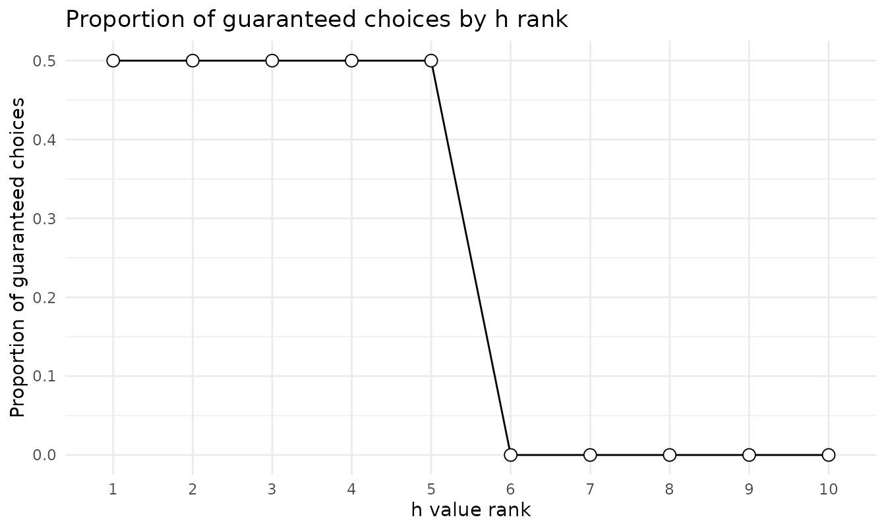

# Scoring the Probability Discounting Questionnaire (PDQ)

The 30-item Probability Discounting Questionnaire (PDQ; Madden, Petry, &
Johnson, 2009) measures preference between smaller guaranteed rewards
and larger probabilistic rewards. Items form three 10-question blocks –
\$20 for sure vs. a chance of \$80, \$40 vs. \$100, and \$40 vs. \$60 –
each an ascending ladder of discount rates (h) at indifference under the
hyperbolic odds-against model V = A / (1 + h \* theta), where theta =
(1 - p) / p (Rachlin, Raineri, & Cross, 1991).

## Scoring

[`score_pdq()`](https://brentkaplan.github.io/beezdiscounting/reference/score_pdq.md)
expects long-form data with `subjectid`, `questionid` (1-30, the
administered order), and `response` (0 = guaranteed, 1 = risky). Each
block is scored independently by the same consistency-maximization
algorithm used for the MCQ; the implementation reproduces the Gray et
al. (2016) scoring syntax for every possible response pattern.

``` r

score_pdq(pdq)
#>   subjectid overall_h block1_h block2_h block3_h   mean_h geomean_h
#> 1         1  1.224745 1.215571 1.224745 1.233988 1.224768  1.224745
#> 2         2  0.329268 0.333333 0.329268 0.333333 0.331978  0.331973
#>   overall_consistency block1_consistency block2_consistency block3_consistency
#> 1                   1                  1                  1                  1
#> 2                   1                  1                  1                  1
#>   composite_consistency overall_proportion block1_proportion block2_proportion
#> 1                     1                0.5               0.5               0.5
#> 2                     1                1.0               1.0               1.0
#>   block3_proportion impute_method
#> 1               0.5          none
#> 2               1.0          none
```

`block1_h`-`block3_h` are the per-block discount rates; `mean_h` is the
arithmetic mean recommended by Gray et al. (2016) and `geomean_h` the
geometric mean. `block*_proportion` is the risky choice ratio (RCR).
`overall_h` is a beezdiscounting extension – the published scoring has
no overall 30-item ladder, so `overall_h` pools all 30 items into a
single ascending ladder and applies the same consistency-maximization
(see
[`?score_pdq`](https://brentkaplan.github.io/beezdiscounting/reference/score_pdq.md)
for the pooling conventions); prefer `mean_h` when following the
published scoring exactly. Gray et al. recommend excluding subjects
below 80% consistency on any block.

## Proportions by h rank

[`prop_sc()`](https://brentkaplan.github.io/beezdiscounting/reference/prop_sc.md)
reports the proportion choosing the *guaranteed* reward at each h rank –
the complement of the risky choice ratio above.

``` r

prop_sc(pdq)
#> # A tibble: 10 × 2
#>    h_rank prop_sc
#>     <int>   <dbl>
#>  1      1     0.5
#>  2      2     0.5
#>  3      3     0.5
#>  4      4     0.5
#>  5      5     0.5
#>  6      6     0  
#>  7      7     0  
#>  8      8     0  
#>  9      9     0  
#> 10     10     0
plot(prop_sc(pdq))
```



## Trial-level modeling bridge

[`pdq_to_choice()`](https://brentkaplan.github.io/beezdiscounting/reference/pdq_to_choice.md)
reshapes responses into one row per choice with the item design attached
– including `theta`, the odds against winning – ready for trial-level
modeling of probability discounting:

``` r

head(pdq_to_choice(pdq))
#> # A tibble: 6 × 6
#>   id    sc_amount lu_amount  prob theta choice
#>   <chr>     <dbl>     <dbl> <dbl> <dbl>  <dbl>
#> 1 1            20        80  0.1   9         0
#> 2 1            20        80  0.13  6.69      0
#> 3 1            20        80  0.17  4.88      0
#> 4 1            20        80  0.2   4         0
#> 5 1            20        80  0.25  3         0
#> 6 1            20        80  0.33  2.03      1
```

## The item design

``` r

get_lookup_table(instrument = "pdq")
#>    questionid block h_rank overall_rank sc_amount lu_amount prob      theta
#> 1           1     1      1            2        20        80 0.10 9.00000000
#> 2           2     1      2            6        20        80 0.13 6.69230769
#> 3           3     1      3            9        20        80 0.17 4.88235294
#> 4           4     1      4           11        20        80 0.20 4.00000000
#> 5           5     1      5           13        20        80 0.25 3.00000000
#> 6           6     1      6           16        20        80 0.33 2.03030303
#> 7           7     1      7           19        20        80 0.50 1.00000000
#> 8           8     1      8           24        20        80 0.67 0.49253731
#> 9           9     1      9           25        20        80 0.75 0.33333333
#> 10         10     1     10           28        20        80 0.83 0.20481928
#> 11         11     2      1            1        40       100 0.18 4.55555556
#> 12         12     2      2            4        40       100 0.22 3.54545455
#> 13         13     2      3            8        40       100 0.29 2.44827586
#> 14         14     2      4           10        40       100 0.33 2.03030303
#> 15         15     2      5           14        40       100 0.40 1.50000000
#> 16         16     2      6           17        40       100 0.50 1.00000000
#> 17         17     2      7           20        40       100 0.67 0.49253731
#> 18         18     2      8           23        40       100 0.80 0.25000000
#> 19         19     2      9           26        40       100 0.86 0.16279070
#> 20         20     2     10           29        40       100 0.91 0.09890110
#> 21         21     3      1            3        40        60 0.40 1.50000000
#> 22         22     3      2            5        40        60 0.46 1.17391304
#> 23         23     3      3            7        40        60 0.55 0.81818182
#> 24         24     3      4           12        40        60 0.60 0.66666667
#> 25         25     3      5           15        40        60 0.67 0.49253731
#> 26         26     3      6           18        40        60 0.75 0.33333333
#> 27         27     3      7           21        40        60 0.86 0.16279070
#> 28         28     3      8           22        40        60 0.92 0.08695652
#> 29         29     3      9           27        40        60 0.95 0.05263158
#> 30         30     3     10           30        40        60 0.97 0.03092784
#>       hindiff
#> 1   0.3333333
#> 2   0.4482759
#> 3   0.6144578
#> 4   0.7500000
#> 5   1.0000000
#> 6   1.4776119
#> 7   3.0000000
#> 8   6.0909091
#> 9   9.0000000
#> 10 14.6470588
#> 11  0.3292683
#> 12  0.4230769
#> 13  0.6126761
#> 14  0.7388060
#> 15  1.0000000
#> 16  1.5000000
#> 17  3.0454545
#> 18  6.0000000
#> 19  9.2142857
#> 20 15.1666667
#> 21  0.3333333
#> 22  0.4259259
#> 23  0.6111111
#> 24  0.7500000
#> 25  1.0151515
#> 26  1.5000000
#> 27  3.0714286
#> 28  5.7500000
#> 29  9.5000000
#> 30 16.1666667
```

## References

Gray, J. C., Amlung, M. T., Palmer, A. A., & MacKillop, J. (2016).
Syntax for calculation of discounting indices from the monetary choice
questionnaire and probability discounting questionnaire. *Journal of the
Experimental Analysis of Behavior, 106*(2), 156-163.

Madden, G. J., Petry, N. M., & Johnson, P. S. (2009). Pathological
gamblers discount probabilistic rewards less steeply than matched
controls. *Experimental and Clinical Psychopharmacology, 17*(5),
283-290.

Rachlin, H., Raineri, A., & Cross, D. (1991). Subjective probability and
delay. *Journal of the Experimental Analysis of Behavior, 55*(2),
233-244.
