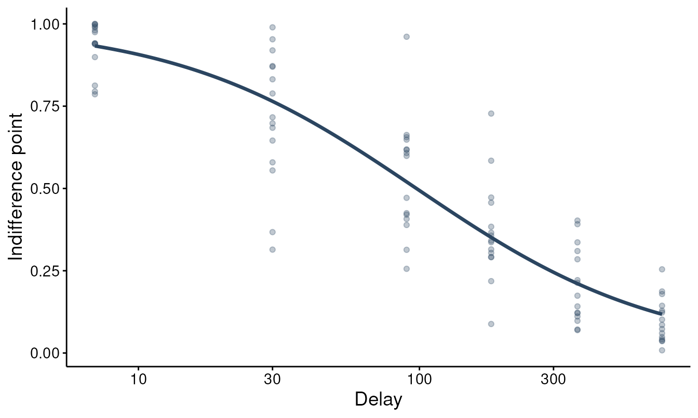
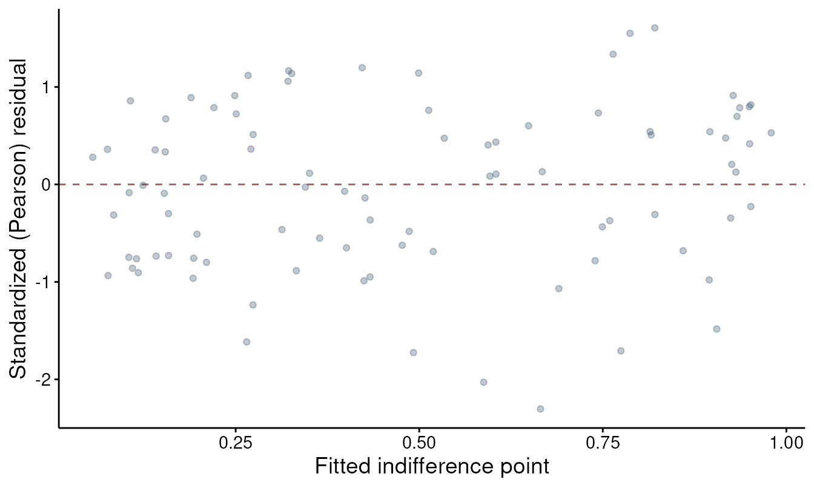

# Mixed-effects discounting with TMB

Fitting each subject’s discounting curve in isolation ignores that
subjects are samples from a population. The mixed-effects tier in
`beezdiscounting` estimates a population discount rate and each
subject’s rate at the same time, borrowing strength across subjects so
that noisy individuals are pulled toward the group.
[`fit_dd_tmb()`](https://brentkaplan.github.io/beezdiscounting/reference/fit_dd_tmb.md)
is the engine for that tier. For a practical guide to this style of
multilevel analysis of discounting indifference points, see Young
(2017).

This vignette is a tour of the
[`fit_dd_tmb()`](https://brentkaplan.github.io/beezdiscounting/reference/fit_dd_tmb.md)
workflow and the methods that act on a fitted model. It pairs with two
other vignettes:
[`vignette("sltb-discounting")`](https://brentkaplan.github.io/beezdiscounting/articles/sltb-discounting.md)
explains *why* indifference points need a bounded error distribution and
develops the scale-location-truncated beta (SLT-beta) likelihood used
below, and
[`vignette("dd-group-comparisons")`](https://brentkaplan.github.io/beezdiscounting/articles/dd-group-comparisons.md)
goes deeper on contrasting groups. Here the focus is the model object
and what you can do with it.

## Why TMB

The discount rate is estimated on the natural-log scale, where the log-k
predictor is linear in the fixed effects, which makes each subject’s
rate `k_i = exp(population log-k + random deviation)`. Integrating the
random deviations out of the likelihood has no closed form. Template
Model Builder (TMB) handles it with a Laplace approximation and
automatic differentiation: exact gradients, a fast compiled objective,
and maximum-likelihood estimates in seconds rather than minutes. TMB
must be installed for any of this to run.

## Some data

[`simulate_dd_ip()`](https://brentkaplan.github.io/beezdiscounting/reference/simulate_dd_ip.md)
generates indifference-point data from the same model
[`fit_dd_tmb()`](https://brentkaplan.github.io/beezdiscounting/reference/fit_dd_tmb.md)
fits, which makes it convenient for a reproducible walk-through. The
built-in `dd_ip` dataset works exactly the same way.

``` r

sim <- simulate_dd_ip(
  n_subjects = 15,
  delays     = c(7, 30, 90, 180, 365, 730),
  log_k_pop  = log(0.01),
  sigma_u    = 0.5,
  phi        = 10,
  family     = "sltb",
  equation   = "mazur",
  seed       = 1
)
head(sim)
#> # A tibble: 6 × 3
#>   id        x     y
#>   <fct> <dbl> <dbl>
#> 1 1         7 0.975
#> 2 1        30 0.870
#> 3 1        90 0.608
#> 4 1       180 0.291
#> 5 1       365 0.402
#> 6 1       730 0.187
```

The data are long format with columns `id`, `x` (delay), and `y`
(indifference point on `[0, 1]`), the same layout used throughout the
package.

## Fitting a model

A one-group hyperbolic model with a random intercept on log-k and the
SLT-beta likelihood:

``` r

fit <- fit_dd_tmb(
  sim,
  equation       = "mazur",
  family         = "sltb",
  random_effects = k ~ 1
)
#> Fitting TMB mixed-effects discounting model (mazur, sltb)...
#>   Subjects: 15, Observations: 90
#>   Multi-start: best NLL = -87.54 (start set 2 of 3)
#>   Converged (NLL = -87.54). Done.
fit
#> 
#> TMB Mixed-Effects Discounting Model
#> 
#> Call:
#> fit_dd_tmb(data = sim, equation = "mazur", family = "sltb", random_effects = k ~ 
#>     1)
#> 
#> Equation: mazur 
#> Family: sltb 
#> Convergence: Yes 
#> Number of subjects: 15 
#> Number of observations: 90 
#> Random effects: 1 (k ~ 1)
#> Log-likelihood: 87.54 
#> AIC: -169.08 
#> 
#> Fixed Effects (log k):
#> k:(Intercept) 
#>       -4.5802 
#> 
#> Use summary() for full results.
```

The `random_effects = k ~ 1` formula puts a subject random intercept on
the discount rate. `family = "sltb"` selects the bounded error
distribution; use `family = "gaussian"` for unbounded residuals.

## Inspecting the fit

[`summary()`](https://rdrr.io/r/base/summary.html) reports the fixed
effect (the population `k` on the natural scale), the variance
components, and fit statistics:

``` r

summary(fit)
#> 
#> TMB Mixed-Effects Discounting Model Summary
#> ================================================== 
#> 
#> Call:
#> fit_dd_tmb(data = sim, equation = "mazur", family = "sltb", random_effects = k ~ 
#>     1) 
#> 
#> Equation: mazur 
#> Family: sltb 
#> Backend: TMB_mixed 
#> Convergence: Yes 
#> Subjects: 15  Observations: 90 
#> 
#> --- Fixed Effects (k) ---
#>           term estimate std.error statistic p.value
#>  k:(Intercept)   0.0103    0.0016  -30.0245  <2e-16
#> 
#> --- Variance Components ---
#>                Component Estimate   Scale
#>  sigma_u (log10-k RE SD)   0.2287   log10
#>          phi (precision)  12.3247 natural
#> 
#> --- Fit Statistics ---
#> Log-likelihood: 87.54 
#> AIC: -169.08   BIC: -161.58
```

[`tidy()`](https://generics.r-lib.org/reference/tidy.html) returns the
same information as a data frame (one row per term, with the scale each
estimate is reported on), which is handy for tables and for stacking
models:

``` r

tidy(fit)
#> # A tibble: 3 × 8
#>   term          estimate std.error statistic    p.value component estimate_scale
#>   <chr>            <dbl>     <dbl>     <dbl>      <dbl> <chr>     <chr>         
#> 1 k:(Intercept)   0.0103   0.00156     -30.0  4.70e-198 fixed     natural       
#> 2 sigma_u (log…   0.229   NA            NA   NA         variance  log10         
#> 3 phi (precisi…  12.3     NA            NA   NA         variance  natural       
#> # ℹ 1 more variable: term_display <chr>
```

[`glance()`](https://generics.r-lib.org/reference/glance.html) gives a
one-row model summary for comparisons:

``` r

glance(fit)
#> # A tibble: 1 × 11
#>   model_class         backend  equation family  nobs n_subjects n_random_effects
#>   <chr>               <chr>    <chr>    <chr>  <int>      <int>            <int>
#> 1 beezdiscounting_tmb TMB_mix… mazur    sltb      90         15                1
#> # ℹ 4 more variables: converged <lgl>, logLik <dbl>, AIC <dbl>, BIC <dbl>
```

## Subject-level rates

[`ranef()`](https://rdrr.io/pkg/nlme/man/random.effects.html) returns
each subject’s random deviation (`u_i`) and their fitted discount rate
(`k`):

``` r

head(ranef(fit))
#>   id         u_i           k
#> 1  1 -0.58783897 0.007523599
#> 2 10  0.15864424 0.011146530
#> 3 11  0.93521791 0.016777805
#> 4 12  0.05448851 0.010551646
#> 5 13 -0.65165654 0.007274969
#> 6 14 -2.33015497 0.003005893
```

These are the shrinkage estimates: subjects with noisy or extreme data
are pulled toward the population rate, more so when they have fewer or
messier observations.

## Predictions

[`predict()`](https://rdrr.io/r/stats/predict.html) returns fitted
indifference points. The `level` argument chooses between the
population-average curve (random effects set to their mean) and
subject-specific curves. Predict the population curve on a fine grid of
delays and plot it over the raw points:

``` r

grid <- data.frame(x = seq(1, 730, length.out = 100))
head(predict(fit, newdata = grid, level = "population"))
#> # A tibble: 6 × 2
#>       x predict.fixed
#>   <dbl>         <dbl>
#> 1  1            0.990
#> 2  8.36         0.921
#> 3 15.7          0.861
#> 4 23.1          0.809
#> 5 30.5          0.762
#> 6 37.8          0.721

# plot() draws the population curve over the observed points directly; type =
# "individual" adds the per-subject (shrinkage) curves.
plot(fit, type = "population")
```



For data that includes an `id` column, request both levels at once with
`level = c("population", "subject")` to get the population prediction
and each subject’s prediction side by side.

## Diagnostics

[`augment()`](https://generics.r-lib.org/reference/augment.html)
attaches fitted values and residuals to the model frame, including
standardized residuals that account for the SLT-beta’s non-constant
variance:

``` r

aug <- augment(fit)
head(aug)
#> # A tibble: 6 × 6
#>   id        x     y .fitted  .resid .std_resid
#>   <chr> <dbl> <dbl>   <dbl>   <dbl>      <dbl>
#> 1 1         7 0.975   0.950  0.0249     0.417 
#> 2 1        30 0.870   0.816  0.0539     0.507 
#> 3 1        90 0.608   0.596  0.0115     0.0852
#> 4 1       180 0.291   0.425 -0.134     -0.988 
#> 5 1       365 0.402   0.267  0.135      1.12  
#> 6 1       730 0.187   0.154  0.0331     0.334

plot(fit, type = "resid")
```



## Choosing an equation

[`fit_dd_tmb()`](https://brentkaplan.github.io/beezdiscounting/reference/fit_dd_tmb.md)
fits four discounting functions: `"mazur"` and `"exponential"`
(one-parameter), and `"green-myerson"` and `"rachlin"` (two-parameter
hyperboloids that add a curvature exponent). Fit several and compare
them with
[`glance()`](https://generics.r-lib.org/reference/glance.html):

``` r

equations <- c("mazur", "exponential", "green-myerson")
fits <- lapply(equations, function(eq)
  fit_dd_tmb(sim, equation = eq, family = "sltb", random_effects = k ~ 1))
#> Fitting TMB mixed-effects discounting model (mazur, sltb)...
#>   Subjects: 15, Observations: 90
#>   Multi-start: best NLL = -87.54 (start set 2 of 3)
#>   Converged (NLL = -87.54). Done.
#> Fitting TMB mixed-effects discounting model (exponential, sltb)...
#>   Subjects: 15, Observations: 90
#>   Multi-start: best NLL = -53.40 (start set 1 of 3)
#>   Converged (NLL = -53.40). Done.
#> Fitting TMB mixed-effects discounting model (green-myerson, sltb)...
#>   Subjects: 15, Observations: 90
#>   Multi-start: best NLL = -87.54 (start set 3 of 3)
#>   Converged (NLL = -87.54). Done.

do.call(rbind, lapply(fits, function(f) glance(f)[c("equation", "logLik", "AIC", "BIC")]))
#> # A tibble: 3 × 4
#>   equation      logLik   AIC    BIC
#>   <chr>          <dbl> <dbl>  <dbl>
#> 1 mazur           87.5 -169. -162. 
#> 2 exponential     53.4 -101.  -93.3
#> 3 green-myerson   87.5 -167. -157.
```

Because these data were generated from a hyperbola, Mazur wins on AIC;
the exponential fits worse, and the extra parameter in Green-Myerson
does not earn its keep. With real data the ranking is an empirical
question worth checking.

## Beyond one group and one random effect

Add between-subject factors with the `factors` argument, then get
per-group rates and contrasts. Simulate two groups and fit a model with
a condition effect on log-k:

``` r

sim2 <- simulate_dd_ip(
  n_subjects = 30, delays = c(7, 30, 90, 180, 365, 730),
  log_k_pop = log(0.01), sigma_u = 0.6, phi = 12,
  family = "sltb", equation = "mazur",
  n_conditions = 2, delta_k = c(0, log(2)), seed = 42
)

fit2 <- fit_dd_tmb(sim2, equation = "mazur", family = "sltb",
                   random_effects = k ~ 1, factors = "condition")
#> Fitting TMB mixed-effects discounting model (mazur, sltb)...
#>   Subjects: 30, Observations: 180
#>   Multi-start: best NLL = -163.16 (start set 1 of 3)
#>   Converged (NLL = -163.16). Done.

get_dd_param_emms(fit2)
#> # A tibble: 2 × 6
#>   level             k k_log std.error conf.low conf.high
#>   <chr>         <dbl> <dbl>     <dbl>    <dbl>     <dbl>
#> 1 condition=C1 0.0132 -4.33     0.188  0.00915    0.0191
#> 2 condition=C2 0.0176 -4.04     0.188  0.0122     0.0255
```

[`get_dd_comparisons()`](https://brentkaplan.github.io/beezdiscounting/reference/get_dd_comparisons.md)
turns those marginal means into contrasts, reported both on the log10
scale and as multiplicative ratios with Holm-adjusted p-values:

``` r

cmp <- get_dd_comparisons(fit2, compare_specs = ~ condition,
                          contrast_type = "pairwise", adjust = "holm")
cmp$k$contrasts_ratio
#> # A tibble: 1 × 5
#>   contrast                    ratio conf.low conf.high p.value
#>   <chr>                       <dbl>    <dbl>     <dbl>   <dbl>
#> 1 condition=C1 - condition=C2 0.749    0.445      1.26   0.277
```

See
[`vignette("dd-group-comparisons")`](https://brentkaplan.github.io/beezdiscounting/articles/dd-group-comparisons.md)
for the full treatment of group inference.

The random-effects structure can grow too. With the SLT-beta family,
`random_effects = k + phi ~ 1` adds a subject random effect on the
precision, letting each subject have their own spread around the curve;
the two-parameter equations support `k + s ~ 1` for a random curvature.
The `covariance_structure` argument controls whether those two random
effects are allowed to correlate.

## Practical notes

- **TMB is required.** The fitting functions load a compiled C++
  template; if TMB is not installed, the calls fail.
- **Convergence.**
  [`fit_dd_tmb()`](https://brentkaplan.github.io/beezdiscounting/reference/fit_dd_tmb.md)
  runs a short multi-start by default and keeps the best fit that passes
  a sanity check. A returned model carries a `converged` flag; when
  standard errors cannot be computed, the uncertainty columns come back
  `NA`.
- **Column names.** Whatever you call your columns via `id_var`,
  `x_var`, and `y_var`, the model frame and all method output use the
  canonical `id`, `x`, `y`.
- **Factor coding.** Between-subject factors enter through
  [`model.matrix()`](https://rdrr.io/r/stats/model.matrix.html) with the
  session’s contrasts (treatment coding by default). The group means and
  contrasts from
  [`get_dd_param_emms()`](https://brentkaplan.github.io/beezdiscounting/reference/get_dd_param_emms.md)
  and
  [`get_dd_comparisons()`](https://brentkaplan.github.io/beezdiscounting/reference/get_dd_comparisons.md)
  are estimated marginal means, so they do not depend on the contrast
  coding or on the choice of reference level. The raw fixed-effect
  coefficients are read relative to that reference level, so if you
  interpret them directly (rather than through `emmeans`), effect coding
  (`contr.sum`) and centering any continuous covariates make the main
  effects easier to read, especially with interactions (Young, 2017).

## Relationship to Young (2017)

The model fit here is the one-stage nonlinear multilevel approach Young
(2017) advocates for indifference-point data: the population and each
subject are estimated together on the log-k scale, with a random
intercept on log k, instead of fitting each subject in isolation and
averaging the per-subject estimates. The two-parameter equations can
extend this, via `random_effects = k + s ~ 1`, to a correlated random
effect on the curvature, as Young describes for the hyperboloids.

Two things differ from Young’s treatment. First, the default error
family is the bounded SLT-beta rather than normal residuals, so the
non-constant variance of indifference points (and observations at
exactly 0 or 1) is modeled instead of assumed away;
`family = "gaussian"` recovers the normal-error model for a closer
comparison. Second, estimation uses TMB’s Laplace approximation with
exact automatic differentiation in place of `nlme`. See
[`vignette("sltb-discounting")`](https://brentkaplan.github.io/beezdiscounting/articles/sltb-discounting.md)
for the error model and Young (2017) for the multilevel framework.

## See also

- [`vignette("sltb-discounting")`](https://brentkaplan.github.io/beezdiscounting/articles/sltb-discounting.md)
  for the SLT-beta error model and why bounded indifference points need
  it.
- [`vignette("dd-group-comparisons")`](https://brentkaplan.github.io/beezdiscounting/articles/dd-group-comparisons.md)
  for comparing discount rates between groups.
- [`vignette("delay-discounting-basics")`](https://brentkaplan.github.io/beezdiscounting/articles/delay-discounting-basics.md)
  for single-subject fitting, `k`, and AUC.
- [`vignette("bayesian-discounting")`](https://brentkaplan.github.io/beezdiscounting/articles/bayesian-discounting.md)
  for the same models in a Bayesian framework.

## References

- Young, M. E. (2017). Discounting: A practical guide to multilevel
  analysis of indifference data. *Journal of the Experimental Analysis
  of Behavior, 108*(1), 97-112. <https://doi.org/10.1002/jeab.265>
