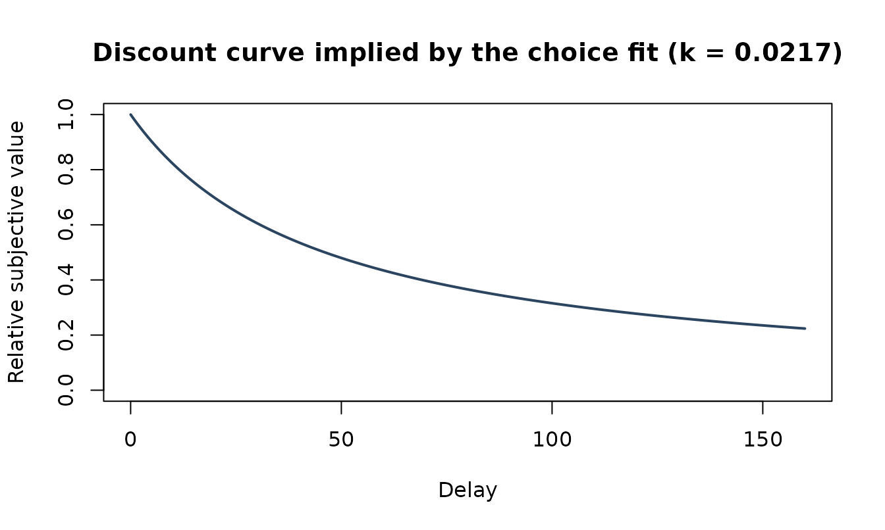

# Discounting from trial-level choices

Most discounting analyses start from indifference points (the amount
that makes a delayed reward feel equal to an immediate one). Many tasks,
though, record the raw decisions instead: for each offer, did the person
take the smaller-sooner (SS) reward or wait for the larger-later (LL)
one?
[`fit_dd_choice()`](https://brentkaplan.github.io/beezdiscounting/reference/fit_dd_choice.md)
models those trial-level choices directly, without reducing them to
indifference points first.

It fits two kinds of model:

- a **structural** model that assumes a discount function and estimates
  the discount rate `k` from the choices, and
- a **descriptive** model (Young, 2018) that predicts the choice from
  its features (the amount ratio and the delay) without committing to a
  discount function.

This vignette is a tour of both. It pairs with
[`vignette("delay-discounting-basics")`](https://brentkaplan.github.io/beezdiscounting/articles/delay-discounting-basics.md)
(the indifference-point workflow),
[`vignette("dd-group-comparisons")`](https://brentkaplan.github.io/beezdiscounting/articles/dd-group-comparisons.md)
(contrasting `k` across groups), and
[`vignette("bayesian-discounting")`](https://brentkaplan.github.io/beezdiscounting/articles/bayesian-discounting.md)
(the brms versions). TMB must be installed for the models to run.

## Data format

Choice data are long, one row per trial, with five columns: a subject
`id`, the smaller-sooner amount `ss_amount`, the larger-later amount
`ll_amount`, the `delay` to the larger reward, and the `choice` (`0` =
chose SS, `1` = chose LL).
[`simulate_dd_choice()`](https://brentkaplan.github.io/beezdiscounting/reference/simulate_dd_choice.md)
generates data in exactly that layout, which makes it convenient for a
reproducible walk-through; bring your own frame with the same columns
for a real analysis.

``` r

ch <- simulate_dd_choice(n_subjects = 30, log_k_pop = log(0.02), seed = 1)
head(ch)
#> # A tibble: 6 × 5
#>   id    ss_amount ll_amount delay choice
#>   <chr>     <dbl>     <dbl> <dbl>  <int>
#> 1 1            40        65    25      0
#> 2 1            55        75    61      0
#> 3 1            31        85    14      1
#> 4 1            14        25    19      1
#> 5 1            47        60   160      0
#> 6 1            25        30     7      1
```

## Structural model

`fit_dd_choice(mode = "structural")` is the model to use when you want a
discount rate. It compares the discounted value of the larger-later
reward against the smaller-sooner reward on every trial and estimates
`log k` directly:

`logit P(LL) = b0 + gamma ((ll / ss) D(k, delay) - 1)`,

where `D(k, delay)` is the discount function (Mazur’s hyperbola by
default), `gamma` is the choice sensitivity (how sharply choices follow
value), and the optional `b0` is a side-independent choice bias (off by
default). The comparison is scale-invariant, so only the ratio of the
rewards matters.

``` r

fit_s <- fit_dd_choice(ch, mode = "structural", verbose = 0)
summary(fit_s)
#> 
#> Structural Choice Discounting Model Summary
#> ================================================== 
#> 
#> Call:
#> fit_dd_choice(data = ch, mode = "structural", verbose = 0) 
#> 
#> Mode: structural 
#> Equation: mazur 
#> Backend: TMB_choice 
#> Convergence: Yes 
#> Subjects: 30  Observations: 300 
#> 
#> --- Fixed Effects (k) ---
#>           term estimate std.error statistic p.value
#>  k:(Intercept)   0.0217    0.0029   -29.156  <2e-16
#>          gamma   4.9956    0.7467    10.762  <2e-16
#> 
#> --- Variance Components ---
#>                Component Estimate Scale
#>  sigma_u (log10-k RE SD)   0.1339 log10
#> 
#> --- Fit Statistics ---
#> Log-likelihood: -113.6 
#> AIC: 233.19   BIC: 244.3 
#> 
#> Notes:
#>   * gamma is the choice-sensitivity (slope) parameter on the logit scale.
```

The fixed-effect `k` is on the natural scale, alongside `gamma`. A
subject random intercept on `log k` lets each person have their own
rate, pooled toward the group.
[`tidy()`](https://generics.r-lib.org/reference/tidy.html) returns the
same information as a data frame:

``` r

tidy(fit_s)
#> # A tibble: 3 × 8
#>   term          estimate std.error statistic    p.value component estimate_scale
#>   <chr>            <dbl>     <dbl>     <dbl>      <dbl> <chr>     <chr>         
#> 1 k:(Intercept)   0.0217   0.00285     -29.2  7.02e-187 fixed     natural       
#> 2 gamma           5.00     0.747        10.8  5.20e- 27 shape     natural       
#> 3 sigma_u (log…   0.134   NA            NA   NA         variance  log10         
#> # ℹ 1 more variable: term_display <chr>
```

Because the model estimates a discount rate, it implies a discounting
curve, the same object the indifference-point models produce. Reading
`k` off the fit and drawing `D(k, delay) = 1 / (1 + k * delay)` shows
it:

``` r

k_hat <- tidy(fit_s)$estimate[tidy(fit_s)$term == "k:(Intercept)"][1]
delays <- seq(0, max(ch$delay), length.out = 200)
plot(delays, 1 / (1 + k_hat * delays),
  type = "l", lwd = 2, col = "#2B4560", ylim = c(0, 1),
  xlab = "Delay", ylab = "Relative subjective value",
  main = sprintf("Discount curve implied by the choice fit (k = %.4f)", k_hat)
)
```



## Descriptive model (Young, 2018)

`fit_dd_choice(mode = "descriptive")` takes a different stance. Rather
than assume a discount function, it predicts the choice with a logistic
mixed model whose fixed effects are the log amount ratio,
`log(ll / ss)`, and the log delay, `log(delay + 1)`, with subject random
slopes on both. The coefficients (`theta`) are sensitivities on the
logit scale, not a discount rate.

``` r

fit_d <- fit_dd_choice(ch, mode = "descriptive", verbose = 0)
summary(fit_d)
#> 
#> Descriptive (Young 2018) Choice Discounting Model Summary
#> ================================================== 
#> 
#> Call:
#> fit_dd_choice(data = ch, mode = "descriptive", verbose = 0) 
#> 
#> Backend: TMB_choice   Convergence: Yes 
#> Subjects: 30  Observations: 300 
#> 
#> --- Fixed sensitivities (logit scale) ---
#>                      term estimate std.error statistic  p.value
#>  log(ll_amount/ss_amount)   6.4112     0.964    6.6507 2.92e-11
#>            log(delay + 1)  -0.9000     0.964   -0.9337     0.35
#> 
#> --- Random-slope (co)variances ---
#>    Group                     Term   Variance    StdDev Corr
#>  subject log(ll_amount/ss_amount) 0.81446946 0.9024796   NA
#>  subject           log(delay + 1) 0.04894997 0.2212464   -1
#> 
#> --- Fit Statistics ---
#> Log-likelihood: -122.67   AIC: 255.35   BIC: 273.87 
#> 
#> Notes:
#>   * theta are logit-scale (Young 2018) sensitivities; not exponentiated.
```

Interpret the sensitivities by their sign. A positive sensitivity on
`log(ll / ss)` means choices move toward the larger-later reward as it
grows relative to the smaller-sooner one; a negative sensitivity on
`log(delay + 1)` means a longer wait pushes choices back toward
smaller-sooner. The descriptive model does not return a `k`, so it
cannot draw a discounting curve, but it does not depend on the discount
function being correctly specified either. (The random-slope covariance
is weakly identified in this small fixed-item example, so its
correlation can sit at the boundary; read the fixed sensitivities
first.)

Use the structural model when you want an interpretable discount rate
that is comparable across tasks and groups under a shared discount
function. Reach for the descriptive model when you want a function-free
summary of what drives the choices, or as a check on whether the
structural form is doing the data justice.

## S3 methods

Both fits carry the broom and base S3 surface.
[`glance()`](https://generics.r-lib.org/reference/glance.html) gives a
one-row model summary; [`coef()`](https://rdrr.io/r/stats/coef.html)
returns the raw parameter vector on the optimizer’s log scale
([`summary()`](https://rdrr.io/r/base/summary.html) and
[`tidy()`](https://generics.r-lib.org/reference/tidy.html) report `k`
and `gamma` back-transformed to the natural scale); and
[`predict()`](https://rdrr.io/r/stats/predict.html) adds a `.prob`
column with the per-trial probability of choosing larger-later:

``` r

glance(fit_s)
#> # A tibble: 1 × 11
#>   model_class backend mode  equation  nobs n_subjects n_random_effects converged
#>   <chr>       <chr>   <chr> <chr>    <int>      <int>            <int> <lgl>    
#> 1 beezdiscou… TMB_ch… stru… mazur      300         30                1 TRUE     
#> # ℹ 3 more variables: logLik <dbl>, AIC <dbl>, BIC <dbl>

head(predict(fit_s))
#> # A tibble: 6 × 6
#>   id    ss_amount ll_amount delay choice  .prob
#>   <chr>     <dbl>     <dbl> <dbl>  <dbl>  <dbl>
#> 1 1            40        65    25      0 0.597 
#> 2 1            55        75    61      0 0.125 
#> 3 1            31        85    14      1 0.997 
#> 4 1            14        25    19      1 0.809 
#> 5 1            47        60   160      0 0.0295
#> 6 1            25        30     7      1 0.563
```

[`tidy()`](https://generics.r-lib.org/reference/tidy.html),
[`summary()`](https://rdrr.io/r/base/summary.html),
[`print()`](https://rdrr.io/r/base/print.html),
[`logLik()`](https://rdrr.io/r/stats/logLik.html),
[`AIC()`](https://rdrr.io/r/stats/AIC.html), and
[`BIC()`](https://rdrr.io/r/stats/AIC.html) work as well.

## From the 27-item MCQ to choices

The 27-item Monetary Choice Questionnaire is itself a set of SS-vs-LL
choices, so its responses fit this model after reshaping.
[`mcq27_to_choice()`](https://brentkaplan.github.io/beezdiscounting/reference/mcq27_to_choice.md)
turns the long-form questionnaire (`subjectid` / `questionid` /
`response`) into the per-trial frame, using the Kirby, Petry, and Bickel
(1999) item design:

``` r

mc <- mcq27_to_choice(mcq27)
head(mc)
#> # A tibble: 6 × 5
#>   id    ss_amount ll_amount delay choice
#>   <chr>     <dbl>     <dbl> <dbl>  <dbl>
#> 1 1            54        55   117      0
#> 2 1            55        75    61      0
#> 3 1            19        25    53      0
#> 4 1            31        85     7      1
#> 5 1            14        25    19      1
#> 6 1            47        50   160      0

fit_mcq <- fit_dd_choice(mc, mode = "structural", verbose = 0)
tidy(fit_mcq)
#> # A tibble: 3 × 8
#>   term            estimate std.error statistic  p.value component estimate_scale
#>   <chr>              <dbl>     <dbl>     <dbl>    <dbl> <chr>     <chr>         
#> 1 k:(Intercept)    0.00576   0.00864     -3.44  5.86e-4 fixed     natural       
#> 2 gamma           17.9      12.2          4.22  2.50e-5 shape     natural       
#> 3 sigma_u (log10…  0.907    NA           NA    NA       variance  log10         
#> # ℹ 1 more variable: term_display <chr>
```

This targets the same Mazur `k` construct and Kirby item design that
[`score_mcq27()`](https://brentkaplan.github.io/beezdiscounting/reference/score_mcq27.md)
uses, but estimates it with a mixed-effects likelihood model rather than
the per-subject Kirby threshold scorer (see
[`vignette("mcq27-scoring")`](https://brentkaplan.github.io/beezdiscounting/articles/mcq27-scoring.md)
for the classic scorer).

## Indifference points and choices agree

The structural choice model and the indifference-point models target the
same discount rate, so they should land in the same place when the data
come from the same process. Simulating both from a common `log k` and
fitting each confirms it:

``` r

lk <- log(0.02)

ip <- simulate_dd_ip(
  n_subjects = 30, log_k_pop = lk,
  family = "sltb", equation = "mazur", seed = 3
)
fit_ip <- fit_dd_tmb(ip, equation = "mazur", family = "sltb", random_effects = k ~ 1)
#> Fitting TMB mixed-effects discounting model (mazur, sltb)...
#>   Subjects: 30, Observations: 210
#>   Multi-start: best NLL = -340.78 (start set 2 of 3)
#>   Converged (NLL = -340.78). Done.

choices <- simulate_dd_choice(n_subjects = 30, log_k_pop = lk, seed = 3)
fit_ch <- fit_dd_choice(choices, mode = "structural", verbose = 0)

c(
  truth = exp(lk),
  indifference_point = tidy(fit_ip)$estimate[tidy(fit_ip)$term == "k:(Intercept)"][1],
  choice = tidy(fit_ch)$estimate[tidy(fit_ch)$term == "k:(Intercept)"][1]
)
#>              truth indifference_point             choice 
#>         0.02000000         0.01791425         0.01914801
```

The two estimates are compatible in this controlled simulation,
recovering the same rate from different data; the package’s IP-vs-choice
tie-out test checks that this agreement holds within tolerance.

## Where to go next

- To compare `k` between groups (treatment vs. control, and the like),
  add `factors =` and use
  [`get_dd_param_emms()`](https://brentkaplan.github.io/beezdiscounting/reference/get_dd_param_emms.md)
  /
  [`get_dd_comparisons()`](https://brentkaplan.github.io/beezdiscounting/reference/get_dd_comparisons.md),
  covered in
  [`vignette("dd-group-comparisons")`](https://brentkaplan.github.io/beezdiscounting/articles/dd-group-comparisons.md).
- For a Bayesian fit of the structural choice model,
  [`fit_dd_choice_brms()`](https://brentkaplan.github.io/beezdiscounting/reference/fit_dd_choice_brms.md)
  takes the same data and design; see
  [`vignette("bayesian-discounting")`](https://brentkaplan.github.io/beezdiscounting/articles/bayesian-discounting.md).

## References

- Kirby, K. N., Petry, N. M., & Bickel, W. K. (1999). Heroin addicts
  have higher discount rates for delayed rewards than non-drug-using
  controls. *Journal of Experimental Psychology: General, 128*(1),
  78-87.
- Mazur, J. E. (1987). An adjusting procedure for studying delayed
  reinforcement. In M. L. Commons, J. E. Mazur, J. A. Nevin, & H.
  Rachlin (Eds.), *The effect of delay and of intervening events on
  reinforcement value* (pp. 55-73). Lawrence Erlbaum Associates.
- Young, M. E. (2018). Discounting: A practical guide to multilevel
  analysis of choice data. *Journal of the Experimental Analysis of
  Behavior, 109*(2), 293-312.
