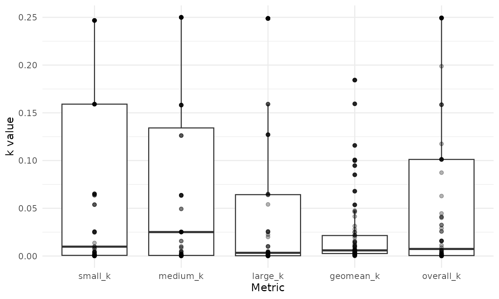
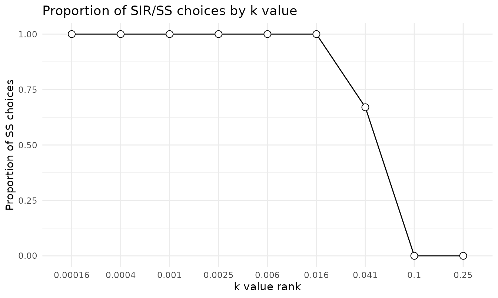

# Scoring the 27-Item Monetary Choice Questionnaire

## The questionnaire

The Monetary Choice Questionnaire (MCQ; Kirby, Petry & Bickel, 1999) is
the most widely used paper-and-pencil measure of delay discounting. Each
item asks the respondent to choose between a smaller reward available
immediately and a larger reward available after a delay, for example
“Would you prefer \$54 today or \$55 in 117 days?” The 27 items are
constructed so that the implied indifference points sweep across a wide
range of discount rates and three reward magnitudes (small, medium,
large). The pattern of choices a person makes estimates their discount
rate `k` in Mazur’s (1987) hyperbola, `V = A / (1 + k * D)`.

Scoring the MCQ by hand is tedious and error-prone. `beezdiscounting`
automates the procedure described in Kaplan et al. (2016), returning `k`
overall and by magnitude, along with the consistency and
choice-proportion diagnostics you need to judge whether a respondent’s
pattern is interpretable.

## Data format

[`score_mcq27()`](https://brentkaplan.github.io/beezdiscounting/reference/score_mcq27.md)
expects long-format data with one row per item per respondent and
exactly three columns: `subjectid`, `questionid` (1–27), and `response`.
The package includes a small example, `mcq27`, with two respondents:

``` r

data(mcq27)
str(mcq27)
#> 'data.frame':    54 obs. of  3 variables:
#>  $ subjectid : num  1 1 1 1 1 1 1 1 1 1 ...
#>  $ questionid: num  1 2 3 4 5 6 7 8 9 10 ...
#>  $ response  : num  0 0 0 1 1 0 1 1 0 0 ...
head(mcq27, 9)
#>   subjectid questionid response
#> 1         1          1        0
#> 2         1          2        0
#> 3         1          3        0
#> 4         1          4        1
#> 5         1          5        1
#> 6         1          6        0
#> 7         1          7        1
#> 8         1          8        1
#> 9         1          9        0
```

Responses are coded `0` when the person chose the smaller, immediate
reward and `1` when they chose the larger, delayed reward. A respondent
who almost always takes the immediate money is a steep discounter (large
`k`); one who waits for the larger reward is a shallow discounter (small
`k`).

The 27 items and the discount rates they bracket are fixed by the Kirby
design. You can inspect that lookup table directly:

``` r

head(get_lookup_table())
#>   questionid magnitude     kindiff  k_rank ss_amount ll_amount delay
#> 1         13         S 0.000158128 0.00016        34        35   186
#> 2          1         M 0.000158278 0.00016        54        55   117
#> 3          9         L 0.000158278 0.00016        78        80   162
#> 4         20         S 0.000399042 0.00040        28        30   179
#> 5          6         M 0.000398936 0.00040        47        50   160
#> 6         17         L 0.000398089 0.00040        80        85   157
```

Each item belongs to a magnitude band (`magnitude`: small, medium, or
large) and sits at one of nine indifference `k` ranks (`k_rank`),
defined by its smaller-immediate amount (`ss_amount`), larger-delayed
amount (`ll_amount`), and `delay` in days.

## Scoring

[`score_mcq27()`](https://brentkaplan.github.io/beezdiscounting/reference/score_mcq27.md)
returns one row per respondent:

``` r

scores <- score_mcq27(mcq27)
scores
#>   subjectid overall_k  small_k medium_k  large_k geomean_k overall_consistency
#> 1         1  0.065212 0.025565 0.063690 0.064947  0.047289            0.962963
#> 2         2  0.000399 0.000633 0.001589 0.000251  0.000632            0.962963
#>   small_consistency medium_consistency large_consistency composite_consistency
#> 1                 1                  1                 1                     1
#> 2                 1                  1                 1                     1
#>   overall_proportion small_proportion medium_proportion large_proportion
#> 1           0.259259         0.333333          0.222222         0.222222
#> 2           0.777778         0.777778          0.666667         0.888889
#>   impute_method
#> 1          none
#> 2          none
```

The output carries three families of columns:

- **Discount rates.** `overall_k` is the single discount rate that best
  matches the full set of choices; `small_k`, `medium_k`, and `large_k`
  are estimated within each magnitude band; `geomean_k` is the geometric
  mean of the three magnitude-specific rates. Discount rates are
  strongly right-skewed, which is why the geometric mean is the
  conventional summary.
- **Consistency.** `overall_consistency` (and the per-magnitude
  versions) is the proportion of the respondent’s choices that agree
  with the estimated `k`. Values near 1 mean the choices form a clean
  switch from delayed to immediate as the implied `k` increases; low
  values signal a noisy or inattentive respondent whose `k` should be
  interpreted cautiously.
- **Choice proportions.** `overall_proportion` and its per-magnitude
  versions give the proportion of larger-delayed choices, a quick,
  model-free index of patience.

### A magnitude effect

Estimating `k` separately by reward magnitude lets you look for the
magnitude effect: discount rates often differ across small, medium, and
large rewards. The `small_k`, `medium_k`, and `large_k` columns make
that comparison directly, within respondent.

## Summarizing a sample

Two respondents are enough to show the mechanics but not to describe a
sample. To illustrate the summary tools, simulate a larger set of
respondents with
[`generate_data_mcq()`](https://brentkaplan.github.io/beezdiscounting/reference/generate_data_mcq.md),
score them, and summarize across people with
[`summarize_mcq()`](https://brentkaplan.github.io/beezdiscounting/reference/summarize_mcq.md):

``` r

sim <- generate_data_mcq(n_ids = 80)
sim_scores <- score_mcq27(sim)
summarize_mcq(sim_scores)
#> # A tibble: 10 × 4
#>    Metric                  Mean     SD     SEM
#>    <chr>                  <dbl>  <dbl>   <dbl>
#>  1 overall_k             0.0595 0.0882 0.00986
#>  2 small_k               0.0676 0.0924 0.0103 
#>  3 medium_k              0.0707 0.0947 0.0106 
#>  4 large_k               0.0519 0.0860 0.00962
#>  5 geomean_k             0.0227 0.0398 0.00445
#>  6 overall_consistency   0.632  0.0617 0.00690
#>  7 small_consistency     0.700  0.111  0.0124 
#>  8 medium_consistency    0.710  0.104  0.0116 
#>  9 large_consistency     0.729  0.112  0.0125 
#> 10 composite_consistency 0.713  0.0597 0.00667
```

[`summarize_mcq()`](https://brentkaplan.github.io/beezdiscounting/reference/summarize_mcq.md)
returns the mean, standard deviation, and standard error of the k and
consistency metrics across respondents. The
[`plot()`](https://rdrr.io/r/graphics/plot.default.html) method for a
scored object shows the distribution of `k` across magnitudes:

``` r

plot(sim_scores)
```



## A model-free look at the choice gradient

[`prop_ss()`](https://brentkaplan.github.io/beezdiscounting/reference/prop_ss.md)
reports the proportion of smaller-immediate choices at each of the nine
`k` ranks, pooled across whatever respondents you pass it. For a single
respondent, three items sit at each rank (one per magnitude), which
gives a quick picture of where, along the discount-rate continuum, that
person switches from waiting to taking the immediate reward:

``` r

s1 <- subset(mcq27, subjectid == 1)
prop_ss(s1)
#> # A tibble: 9 × 2
#>    k_rank prop_ss
#>     <dbl>   <dbl>
#> 1 0.00016    1   
#> 2 0.0004     1   
#> 3 0.001      1   
#> 4 0.0025     1   
#> 5 0.006      1   
#> 6 0.016      1   
#> 7 0.041      0.67
#> 8 0.1        0   
#> 9 0.25       0
plot(prop_ss(s1))
```



## Converting between layouts

Raw MCQ data arrive in different shapes.
[`wide_to_long_mcq()`](https://brentkaplan.github.io/beezdiscounting/reference/wide_to_long_mcq.md)
and
[`long_to_wide_mcq()`](https://brentkaplan.github.io/beezdiscounting/reference/long_to_wide_mcq.md)
move between a wide layout (one column per item) and the long layout
[`score_mcq27()`](https://brentkaplan.github.io/beezdiscounting/reference/score_mcq27.md)
expects:

``` r

wide <- long_to_wide_mcq(mcq27)
dim(wide)
#> [1]  2 28
long <- wide_to_long_mcq(wide)
head(long, 3)
#> # A tibble: 3 × 3
#>   subjectid questionid response
#>       <dbl>      <int>    <dbl>
#> 1         1          1        0
#> 2         1          2        0
#> 3         1          3        0
```

[`wide_to_long_mcq_excel()`](https://brentkaplan.github.io/beezdiscounting/reference/wide_to_long_mcq_excel.md)
and
[`long_to_wide_mcq_excel()`](https://brentkaplan.github.io/beezdiscounting/reference/long_to_wide_mcq_excel.md)
handle the column layout used by the published Excel automated scorer,
which lets data prepared for that tool be read in without reformatting.

## Handling missing responses

When a respondent leaves items blank, the `impute_method` argument
controls how the `NA` responses are handled: `"none"` (the default; they
stay `NA`), `"ggm"` (geometric grand-mean handling, which drops `NA`s
when forming `geomean_k`), or `"inn"` (item nearest-neighbor imputation,
following Yeh et al., 2023, which can still leave a value unresolved
unless `random = TRUE`). Every respondent must still have all 27 items
present as rows; `impute_method` governs only the `NA` responses within
them, not missing rows.

## From choices to trial-level data

Because the MCQ is a choice task, its items can also feed the structural
choice models in `beezdiscounting`.
[`mcq27_to_choice()`](https://brentkaplan.github.io/beezdiscounting/reference/mcq27_to_choice.md)
reshapes the responses into the trial-level frame those models expect:

``` r

head(mcq27_to_choice(mcq27))
#> # A tibble: 6 × 5
#>   id    ss_amount ll_amount delay choice
#>   <chr>     <dbl>     <dbl> <dbl>  <dbl>
#> 1 1            54        55   117      0
#> 2 1            55        75    61      0
#> 3 1            19        25    53      0
#> 4 1            31        85     7      1
#> 5 1            14        25    19      1
#> 6 1            47        50   160      0
```

The result (one row per trial with the smaller and larger amounts, the
delay, and the binary choice) is ready for
[`fit_dd_choice()`](https://brentkaplan.github.io/beezdiscounting/reference/fit_dd_choice.md).
See the choice-modeling and TMB vignettes for that workflow.

## References

- Kaplan, B. A., Amlung, M., Reed, D. D., Jarmolowicz, D. P.,
  McKerchar, T. L., & Lemley, S. M. (2016). Automating scoring of delay
  discounting for the 21- and 27-item monetary choice questionnaires.
  *The Behavior Analyst, 39*, 293–304.
- Kirby, K. N., Petry, N. M., & Bickel, W. K. (1999). Heroin addicts
  have higher discount rates for delayed rewards than non-drug-using
  controls. *Journal of Experimental Psychology: General, 128*(1),
  78–87.
- Mazur, J. E. (1987). An adjusting procedure for studying delayed
  reinforcement. In *The effect of delay and of intervening events on
  reinforcement value* (pp. 55–73). Lawrence Erlbaum Associates.
- Yeh, Y. H., Tegge, A. N., Freitas-Lemos, R., Myerson, J., Green, L., &
  Bickel, W. K. (2023). Discounting of delayed rewards: Missing data
  imputation for the 21- and 27-item monetary choice questionnaires.
  *PLOS ONE, 18*(10), e0292258.
